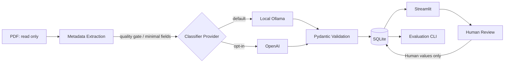

# SecPaper Atlas

セキュリティ研究論文のPDFをローカルで解析し、メタデータ抽出・AI分類・検索・Human Review・評価を行う研究支援ツール。

**v0.1.1 — ローカル完成版。** デフォルトの分類はOllama / `qwen3:4b`を使用する。元PDFを変更せず、AIの予測と人間のレビュー値を分離して保存する。

## Features

- **PDF extraction:** PyMuPDFでタイトル・著者・年・Abstract・Keywordsを抽出。抽出品質に問題がある入力は分類前にレビュー待ちにする。
- **Duplicate detection:** SHA-256で内容が同じPDFの重複登録を防ぐ。
- **Local LLM classification:** Ollama / `qwen3:4b`で8カテゴリ、Tags、Methods、Target Vulnerabilities、Relevanceを提案する。
- **Structured JSON + Pydantic validation:** 共通スキーマで出力を検証し、不正な応答を保存可能な分類結果として扱わない。
- **SQLite + Streamlit dashboard:** 論文一覧・詳細・件数・カテゴリ分布を表示し、キーワード検索とカテゴリ・タグ・手法・脆弱性・Relevance・状態・年のフィルタを提供する。
- **Favorite / Read Later:** 一覧のチェック欄と詳細のトグルでお気に入り・後で読むキューを即保存。状態はローカルSQLiteへ永続化され、各フィルタと両方のAND絞り込みを既存検索に組み合わせられる。AI分類・Human Review・Ground Truthとは別の利用者管理データ。
- **Human Review:** AI predictionとHuman値を別々に保持。明示的なレビュー保存でHuman値を作成し、再分類でも人間の修正と過去のAI出力を保持する。
- **Evaluation:** CSVまたは保存済みprovider/model別の分類履歴をHumanラベルと比較するPrimary Category評価CLI。
- **Optional OpenAI provider:** 明示的に選択した場合だけ、限定した論文情報を外部APIへ送信する。

## Folders / フォルダとNotes / ノート

サイドバーの「＋ 新しいフォルダ」から好きな名前でフォルダを作成し、
論文詳細の「フォルダ」で複数選択して保存する。1本の論文を複数のフォルダに整理できる。
サイドバーでフォルダを開くと所属論文だけを表示し、Favorite・Read Later・キーワード・
カテゴリ・Relevanceなどのフィルターも併用できる。「すべての論文」で全体へ戻る。

「フォルダの管理」から名前変更・削除ができる。名前は前後の空白を除き1〜100文字。
空白だけの名前や、大小文字・Unicodeの表記差だけの重複は拒否する。
削除は対象フォルダ名を確認してチェックした後に実行する。
削除されるのはフォルダと所属情報だけで、論文・分類・Favorite・Read Later・ノートは保持する。

論文詳細の「ノート」に自由な読書メモを入力し、「ノートを保存」で保存できる（最大10000文字）。
空欄を保存するとメモを消せる。ノートとフォルダは独立して保存され、どちらも分類器には送信しない。


## Why I Built This

研究テーマ候補や関連するセキュリティ論文を整理する際、論文数の増加に伴って手作業の分野分類や関連研究の優先順位付けが難しくなった。ファイル名だけでは研究対象・手法・脆弱性が分からないため、AIが分類案を出し、人間が根拠を確認して整理できるライブラリを作成した。

## Architecture



抽出・分類・保存・UIを分離し、PDFごとに失敗を処理する。SQLiteは値をパラメータ化して扱い、正規化したラベル表で検索する。分類履歴にAI原値とprovider/modelを保持し、Human Reviewでは人間用の値だけを更新する。詳細は[Architecture](docs/ARCHITECTURE.md)を参照。

## Classification Categories

- Authentication
- Session Management
- Authorization
- Token Security
- OAuth / OIDC / SSO
- Account Management
- Vulnerability Assessment
- Other Security

Relevance A / B / Cはセッション安全性を中心とする研究関心との関連度であり、論文の品質評価ではない。

## Evaluation

v0.1.1では`qwen3:4b`の保存済み分類と、人間がRubric v1に基づいて作成したGround Truthを比較した。

| 指標（一致件数 / 8） | Baseline | Final Prompt |
|---|---:|---:|
| Primary Category | 8/8 | 8/8 |
| Relevance | 4/8 | 4/8 |
| Tags: exact match | 0/8 | 0/8 |
| Methods: exact match | 0/8 | 0/8 |
| Target Vulnerabilities: exact match | 2/8 | 6/8 |

Baselineは**8本のみのpilot evaluation**。出現CategoryはAuthentication（1本）、Session Management（4本）、Vulnerability Assessment（3本）の3種類で、他の5カテゴリは未評価。これは`qwen3:4b`の一般性能を示す結果ではない。

同じ8本の誤りを使ってPromptを調整したため、Finalとの比較は**development-set comparison**であり、独立したtest setの評価ではない。Target Vulnerabilitiesの完全一致は増えたが、Tags / Methods / Relevanceには課題が残る。Confidenceはモデルの自己申告値で、校正済み確率ではない。

多項目の集計はローカルの評価用補助スクリプトで実施した。公開CLIの実装範囲はPrimary Category評価。評価条件・途中の変動・限界は[Evaluation Results](docs/EVALUATION_RESULTS.md)、手順は[Evaluation](docs/EVALUATION.md)、判断基準は[Evaluation Rubric](docs/EVALUATION_RUBRIC.md)に記録している。個別のGround Truthと作業ファイルは公開対象外。

## Local-first / Privacy

- デフォルトはOllamaによるローカル分類。論文内容を外部APIへ送らずに利用できる。
- ローカルproviderはloopbackのみを許可し、proxy設定を使用せず、redirect・cloud model参照を拒否する。Ollamaサーバーのcloud機能も無効化して利用する。
- OpenAI providerはoptional。送信対象は抽出したtitle・abstract・keywords、およびAbstract欠落時だけの短いIntroduction excerptに限定し、PDFや全文は送らない。自動的なOpenAIへの切り替えは行わない。
- API KeyはGitから除外する`.env`で管理する。`.env.example`はSecretを含まない設定例。
- PDF・実DB・logs・ローカル評価データはGit管理対象外。元PDFは読み取り専用で扱う。

ソフトウェア導入・モデルのダウンロード・更新は別途ネットワークを使用する。

## AI Usage

**AI分類**は提案、**Human Review**は利用者による修正、**Ground Truth**は固定したRubricに基づく独立した人間の参照ラベル、**評価**は両者の比較として区別する。Human Reviewを自動的にGround Truthとして確定しない。開発時のCodex支援も含め、[AI Usage](docs/AI_USAGE.md)に役割と検証方針を記載している。

## Tech Stack

Python · Streamlit · SQLite · PyMuPDF · Pydantic · Ollama · `qwen3:4b` · pytest（optional: OpenAI Python SDK）

## Setup

Windows / PowerShellでの手順。Python 3.10以上（テスト環境は3.12）と[Ollama](https://ollama.com/download)を用意する。

1. リポジトリをcloneまたはZIP展開し、プロジェクトのルートでPowerShellを開く。

   ```powershell
   py -m venv .venv
   .\.venv\Scripts\python.exe -m pip install -r requirements.txt
   if (-not (Test-Path -LiteralPath .env)) { Copy-Item .env.example .env }
   ```

2. Ollamaをインストールした後、タスクトレイから終了する。Windowsのユーザー環境変数に`OLLAMA_NO_CLOUD=1`、`OLLAMA_HOST=127.0.0.1:11434`を設定し、Ollamaを再起動する。[公式の環境変数設定手順](https://docs.ollama.com/faq#setting-environment-variables-on-windows)を参照。アプリの`.env`だけではOllamaサーバーの設定は変わらない。

3. 新しいPowerShellをルートで開き、モデルを明示的に取得する。

   ```powershell
   ollama pull qwen3:4b
   ollama list
   ```

4. `.env`の`CLASSIFIER_PROVIDER=local`、`LOCAL_LLM_MODEL=qwen3:4b`、`LOCAL_LLM_BASE_URL=http://127.0.0.1:11434`を確認する。モデル名にはコード上のデフォルトがないため、設定が必要。

5. 手元のPDFを`papers/inbox/`へコピーし、アプリを起動する。

   ```powershell
   .\.venv\Scripts\python.exe -m streamlit run app.py
   ```

6. ブラウザで表示されたダッシュボードの**Scan papers/inbox**を選択する。結果を確認し、検索・フィルタ・論文詳細の**Human correction**からレビューする。

DBは`data/papers.db`、ログは`logs/`へ自動作成する。未設定の分類器では抽出のみを行いpendingとして保存し、接続・モデル・応答の問題ではfailedとなる。再スキャンで未分類や失敗を再試行し、分類済みの同一hashはスキップする。導入とトラブル対応は[Local LLM](docs/LOCAL_LLM.md)を参照。

OpenAIを使う場合は`.env`で`CLASSIFIER_PROVIDER=openai`と`OPENAI_API_KEY`、`OPENAI_MODEL`を設定する。

## Testing

```powershell
.\.venv\Scripts\python.exe -m pytest
```

**v0.1.1時点で130 tests passed。** 抽出、重複検出、DB検索、JSON検証、providerの失敗処理、ローカル通信境界、AI/Human分離、再試行、評価をテストする。provider通信はmockを使用し、API Key・モデル取得・実LLM推論は不要。件数は今後の変更で増減する。

## Project Status

**v0.1.1: ローカル完成版。** 分類とライブラリ閲覧に範囲を絞った、単一利用者向けのアプリ。OCRと複数利用者向け運用は未実装で、抽出結果とAI判断は人間の確認を前提とする。評価対象の少なさと分類項目ごとの残る課題を、上記の評価と関連文書で公開している。
