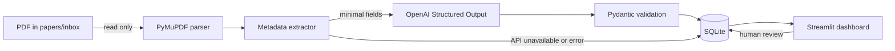

# Research Paper Classifier

A local-first Streamlit application that turns a folder of cybersecurity research PDFs into a searchable, reviewable literature library. Version 0.1 focuses on authentication, session management, authorization, token security, and vulnerability assessment papers.

> **Project status:** v0.1. Source PDFs stay untouched; only extracted metadata and classification results are stored in a local SQLite database.

## Overview

Drop PDFs into `papers/inbox/`, start the app, and select **Scan papers/inbox**. The application detects new files by SHA-256, extracts defensible metadata with PyMuPDF, sends a minimal metadata payload to the OpenAI API for schema-constrained classification, validates the result with Pydantic, and stores it in SQLite. The dashboard then supports full-text-like keyword search, structured filters, and human review.

## Background

This project was created while exploring a cybersecurity graduation-research topic. A growing collection of English papers about authentication and authorization became difficult to organize manually: papers overlap multiple areas, methods are hard to compare across folders, and the papers most relevant to session-security research are not always obvious from filenames.

## Problems

- A folder hierarchy forces each paper into only one location even when it spans several topics.
- Filenames do not expose research methods or target vulnerabilities.
- Manual tagging is slow and inconsistent across a growing library.
- AI classification can be useful, but an opaque or irreversible AI decision is unsuitable for research work.

## Solution

Research Paper Classifier combines deterministic local processing with reviewable AI assistance:

1. Files are identified by content hash, not filename.
2. PDF properties and extracted text provide title, authors, year, abstract, and keywords when available.
3. Only the title, abstract, keywords, and—when the abstract is missing—a bounded introduction excerpt are sent to the OpenAI API.
4. Structured Outputs are validated against a Pydantic schema.
5. Original AI values and user-edited values are stored separately.
6. Normalized label tables make tags, methods, and vulnerabilities filterable.

## Architecture



The pipeline is deliberately synchronous and small for a local v0.1. Each paper is transactionally stored, and a failure processing one PDF does not end the whole scan. See [docs/ARCHITECTURE.md](docs/ARCHITECTURE.md) for the schema and trust boundaries.

## Features

- Read-only PDF discovery with path containment and PDF-signature checks
- Streaming SHA-256 hashing and duplicate prevention
- Conservative metadata and abstract extraction
- Schema-constrained AI classification into:
  - one primary category;
  - multiple tags;
  - multiple research methods;
  - multiple target vulnerabilities;
  - relevance A, B, or C with reason and confidence
- Local SQLite persistence with normalized searchable labels
- Dashboard metrics and category chart
- Keyword search over title, abstract, tags, and vulnerabilities
- Filters for category, tags, methods, vulnerabilities, relevance, status, and year
- Paper detail view and human review of category, tags, methods, vulnerabilities, relevance, reason, and reading status
- Retention of original AI values after manual review
- Per-paper error handling and rotating local logs
- Ground-truth CSV and a baseline category-evaluation command

## Project layout

```text
.
├── app.py
├── papers/inbox/          # user PDFs (ignored by Git)
├── data/                  # local SQLite DB and evaluation CSV
├── logs/                  # local rotating logs
├── scripts/evaluate.py
├── src/
│   ├── classifier.py
│   ├── config.py
│   ├── database.py
│   ├── metadata_extractor.py
│   ├── models.py
│   ├── pdf_parser.py
│   └── scanner.py
├── tests/
└── docs/
```

This layout keeps the Streamlit entry point obvious while separating extraction, AI, orchestration, and persistence into testable modules. It also keeps private runtime artifacts outside source directories.

## Installation on Windows

Prerequisites: Python 3.10 or newer and an OpenAI API key.

```powershell
git clone <repository-url>
cd SecPaper-Atlas
py -m venv .venv
.\.venv\Scripts\Activate.ps1
python -m pip install --upgrade pip
python -m pip install -r requirements.txt
Copy-Item .env.example .env
```

Edit `.env` and replace `your_api_key_here` with your own key. The model is configurable through `OPENAI_MODEL`.

## Usage

1. Copy one or more PDFs into `papers/inbox/`. Nested folders are supported.
2. Start the local app:

   ```powershell
   streamlit run app.py
   ```

3. Select **Scan papers/inbox**.
4. Review the per-paper result summary.
5. Search and filter the library, then open a paper to correct its editable classification.

If no API key is configured, local extraction still runs and the paper is saved as pending with a visible status. Scanning the inbox again retries pending or failed classifications after a key is configured. Metadata that fails the input-quality gate is saved as needs review and is not sent to the API until a later scan produces usable title and abstract/introduction text. The original PDF is never modified.

## Classification model

### Primary categories

`Authentication`, `Session Management`, `Authorization`, `Token Security`, `OAuth / OIDC / SSO`, `Account Management`, `Vulnerability Assessment`, and `Other Security`.

### Tags, methods, and vulnerabilities

Tags describe topics such as MFA, cookies, IDOR, JWT, OAuth, or browser automation. Research methods describe how the work was conducted. Target vulnerabilities describe the security weaknesses or attacks being studied. These fields are many-to-many and searchable. The initial vocabulary guides the AI, while custom tags remain possible during review.

### Relevance

- **A:** directly aligned with the current topic search, especially session security combined with vulnerability assessment or automated/black-box techniques.
- **B:** useful authentication, authorization, token, OAuth/OIDC, or access-control research.
- **C:** security research that is comparatively distant from the current topic search.

Relevance is not a judgment of research quality.

## Security considerations

- API keys are loaded from `.env`, never hard-coded, and `.env` is ignored by Git.
- PDFs, local databases, ground-truth working files, and logs are ignored by default.
- Inbox files are opened read-only. The application does not rename, move, edit, execute, or automatically download PDFs.
- Candidate paths must resolve inside the configured inbox, reducing traversal and symlink-escape risk.
- A `.pdf` suffix alone is insufficient; the PDF magic bytes and PyMuPDF parsing must also succeed.
- SQLite values use bound parameters. Dynamic SQL identifiers come only from internal constant mappings.
- Logs contain filenames, short hash prefixes, statuses, and error types—not API keys, prompts, abstracts, or paper bodies.
- AI receives bounded extracted text, not the complete PDF.

PDF parsers process untrusted, complex files. Run the app with normal user privileges, keep dependencies patched, and avoid opening unknown PDFs in unrelated viewers simply because the app detected them.

## Tests

```powershell
pytest
```

The suite covers PDF discovery, hashing, duplicate handling, database registration and search, schema/category/relevance validation, AI mocking and error sanitization, metadata fallbacks, scan fault isolation, manual-review preservation, and baseline evaluation metrics. API calls are mocked; tests do not require a key or spend API credits.

## Evaluation

Copy reviewed examples into `data/ground_truth.csv` using its existing columns, then run:

```powershell
python scripts/evaluate.py data/ground_truth.csv
```

The v0.1 script reports primary-category accuracy plus per-category precision, recall, F1, and support. See [docs/EVALUATION.md](docs/EVALUATION.md) for sampling guidance and planned metadata/latency metrics.

## AI use and transparency

Codex assisted with implementation, while the application itself uses the OpenAI API for paper classification. AI output is not treated as ground truth: it is schema-validated, visibly editable, and retained separately from human-reviewed values. The development and review policy is documented in [docs/AI_USAGE.md](docs/AI_USAGE.md).

## Limitations

- PDF layouts vary; scanned/image-only files require OCR, which v0.1 does not implement.
- Metadata extraction uses page layout and bounded heading recognition, but layouts vary and extracted values still need human review.
- Classification quality depends on the extracted abstract and selected model.
- Filtering multiple values within one facet currently uses “match any” semantics.
- Previously saved pending and failed classifications can be retried by scanning the inbox; records with unresolved metadata issues remain held for review.
- SQLite and synchronous scanning target one local user, not a multi-user deployment.

## Future work

After classification quality is measured, possible later releases may add full-text translation, semantic search, similar-paper recommendations, citation networks, research-gap analysis, and ChatGPT Project integration. These are intentionally outside v0.1.
