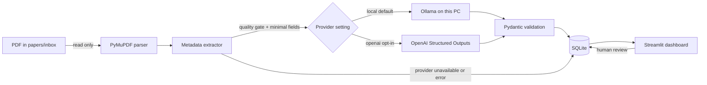

# Research Paper Classifier

A local-first Streamlit application that turns a folder of cybersecurity research PDFs into a searchable, reviewable literature library. Version 0.1 focuses on authentication, session management, authorization, token security, and vulnerability assessment papers.

> **Project status:** v0.1. Source PDFs stay untouched; only extracted metadata and classification results are stored in a local SQLite database.

## Overview

Drop PDFs into `papers/inbox/`, start the app, and select **Scan papers/inbox**. The application detects new files by SHA-256, extracts metadata with PyMuPDF, classifies minimal input with a local Ollama model by default, validates structured results with Pydantic, and stores them in SQLite. OpenAI Structured Outputs remain an optional backend. The dashboard supports keyword search, filters, and human review.

## Background

This project was created while exploring a cybersecurity graduation-research topic. A growing collection of English papers about authentication and authorization became difficult to organize manually: papers overlap multiple areas, methods are hard to compare across folders, and the papers most relevant to session-security research are not always obvious from filenames.

## Problems

- A folder hierarchy forces each paper into only one location even when it spans several topics.
- Filenames do not expose research methods or target vulnerabilities.
- Manual tagging is slow and inconsistent across a growing library.
- AI classification can be useful, but an opaque or irreversible AI decision is unsuitable for research work.

## Solution

Research Paper Classifier combines deterministic local processing with reviewable AI assistance:

1. Files are identified by content hash, not filename.
2. PDF properties and extracted text provide title, authors, year, abstract, and keywords when available.
3. Only title, abstract, keywords, and—when the abstract is missing—a bounded introduction excerpt reach the selected classifier.
4. Both providers share the classification schema and Pydantic validation.
5. Original AI values and user-edited values are stored separately.
6. Normalized label tables make tags, methods, and vulnerabilities filterable.

## Architecture



The pipeline is deliberately synchronous and small for a local v0.1. Each paper is transactionally stored, and a failure processing one PDF does not end the whole scan. See [docs/ARCHITECTURE.md](docs/ARCHITECTURE.md) for the schema and trust boundaries.

## Features

- Read-only PDF discovery with path containment and PDF-signature checks
- Streaming SHA-256 hashing and duplicate prevention
- Conservative metadata and abstract extraction
- Schema-constrained AI classification into:
  - one primary category;
  - multiple tags;
  - multiple research methods;
  - multiple target vulnerabilities;
  - relevance A, B, or C with reason and confidence
- Local SQLite persistence with normalized searchable labels
- Provider/model/timestamp provenance and retained classification history
- Current provider/model in the sidebar and saved provenance in paper details
- AI predictions remain separate from human values; unreviewed predictions are display/filter fallbacks only
- Dashboard metrics and category chart
- Keyword search over title, abstract, tags, and vulnerabilities
- Filters for category, tags, methods, vulnerabilities, relevance, status, and year
- Paper detail view and human review of category, tags, methods, vulnerabilities, relevance, reason, and reading status
- Human correction fields start empty until a person explicitly saves a review
- Retention of original AI values after manual review
- Per-paper error handling and rotating local logs
- Ground-truth CSV and a baseline category-evaluation command

## Project layout

```text
.
├── app.py
├── papers/inbox/          # user PDFs (ignored by Git)
├── data/                  # local SQLite DB and evaluation CSV
├── logs/                  # local rotating logs
├── scripts/evaluate.py
├── src/
│   ├── classifier.py
│   ├── ollama_classifier.py
│   ├── config.py
│   ├── database.py
│   ├── metadata_extractor.py
│   ├── models.py
│   ├── pdf_parser.py
│   └── scanner.py
├── tests/
└── docs/
```

This layout keeps the Streamlit entry point obvious while separating extraction, AI, orchestration, and persistence into testable modules. It also keeps private runtime artifacts outside source directories.

## Installation on Windows

Prerequisites: Python 3.10 or newer. Local classification requires Ollama and an explicitly downloaded local model. An OpenAI API key is optional.

```powershell
git clone <repository-url>
cd SecPaper-Atlas
py -m venv .venv
.\.venv\Scripts\Activate.ps1
python -m pip install --upgrade pip
python -m pip install -r requirements.txt
if (-not (Test-Path -LiteralPath .env)) { Copy-Item .env.example .env }
```

Edit `.env` using the settings below; preserve any existing private settings. The app performs no installation or model download. See [docs/LOCAL_LLM.md](docs/LOCAL_LLM.md) for the proposed Windows setup.

### Classifier settings

```dotenv
CLASSIFIER_PROVIDER=local
LOCAL_LLM_MODEL=qwen3:4b
LOCAL_LLM_BASE_URL=http://127.0.0.1:11434
LOCAL_LLM_TIMEOUT=180
LOCAL_LLM_VALIDATION_RETRIES=1
```

`local` is the default provider. The local model name has no code default and must name an installed model. Ollama receives the common JSON Schema. All fields are required and strictly validated. Invalid JSON/schema permits at most one regeneration; connection, timeout, missing-model and HTTP errors fail immediately. Malformed answers are not repaired or treated as valid.

**Local Providerでは論文情報がPC外へ送信されない。** Only HTTP loopback endpoints are permitted. The client ignores proxies, rejects redirects/cloud model references, and confirms installed local model metadata before submitting paper text. Set `OLLAMA_NO_CLOUD=1` in the Ollama server environment and restart Ollama; loading the app's `.env` does not reconfigure an existing server. Model downloads and Ollama updates are separate network operations that do not carry paper inputs.

For optional external classification, set `CLASSIFIER_PROVIDER=openai`, `OPENAI_API_KEY`, and `OPENAI_MODEL`. Only this selection creates an OpenAI client and sends input externally. There is no automatic fallback to OpenAI. SDK transport retries are disabled and requests have a 60-second timeout.

## Usage

1. Copy one or more PDFs into `papers/inbox/`. Nested folders are supported.
2. Start the local app:

   ```powershell
   streamlit run app.py
   ```

3. Select **Scan papers/inbox**.
4. Review the per-paper result summary.
5. Search and filter the library, then open a paper to correct its editable classification.

If the selected classifier is unconfigured, extraction still runs and new papers are saved as pending. A configured but unavailable server/model or invalid response produces failed records. Scanning again retries pending, failed and needs_review records without inserting duplicate hashes. Classified records are skipped even after a provider/model change; intentional comparison runs can use `scan_inbox(..., reclassify=True)`. Metadata that fails the gate remains needs_review. Source PDFs stay untouched.

## Classification model

### Primary categories

`Authentication`, `Session Management`, `Authorization`, `Token Security`, `OAuth / OIDC / SSO`, `Account Management`, `Vulnerability Assessment`, and `Other Security`.

### Tags, methods, and vulnerabilities

Tags describe topics such as MFA, cookies, IDOR, JWT, OAuth, or browser automation. Research methods describe how the work was conducted. Target vulnerabilities describe the security weaknesses or attacks being studied. These fields are many-to-many and searchable. The initial vocabulary guides the AI, while custom tags remain possible during review.

### Relevance

- **A:** directly aligned with the current topic search, especially session security combined with vulnerability assessment or automated/black-box techniques.
- **B:** useful authentication, authorization, token, OAuth/OIDC, or access-control research.
- **C:** security research that is comparatively distant from the current topic search.

Relevance is not a judgment of research quality.

## Security considerations

- API keys are loaded from `.env`, never hard-coded, and `.env` is ignored by Git.
- PDFs, local databases, ground-truth working files, and logs are ignored by default.
- Inbox files are opened read-only. The application does not rename, move, edit, execute, or automatically download PDFs.
- Candidate paths must resolve inside the configured inbox, reducing traversal and symlink-escape risk.
- A `.pdf` suffix alone is insufficient; the PDF magic bytes and PyMuPDF parsing must also succeed.
- SQLite values use bound parameters. Dynamic SQL identifiers come only from internal constant mappings.
- Logs contain filenames, short hash prefixes, statuses, and error types—not API keys, prompts, abstracts, or paper bodies.
- AI receives bounded extracted text, not the complete PDF.

PDF parsers process untrusted, complex files. Run the app with normal user privileges, keep dependencies patched, and avoid opening unknown PDFs in unrelated viewers simply because the app detected them.

## Tests

```powershell
pytest
```

The suite covers extraction, hashing, database/search/migrations, strict JSON validation, mocked local/OpenAI failures, provider selection, local privacy boundaries, retries, review preservation and evaluation. Tests do not download models, start an LLM server, require a key or spend credits.

## Evaluation

Copy reviewed examples into `data/ground_truth.csv` using its existing columns, then run:

```powershell
python scripts/evaluate.py data/ground_truth.csv
```

The v0.1 script reports primary-category accuracy plus per-category precision, recall, F1, and support. See [docs/EVALUATION.md](docs/EVALUATION.md) for sampling guidance and planned metadata/latency metrics.

Compare saved provider/model runs with explicitly saved Human Review labels:

```powershell
python scripts/evaluate.py --database data/papers.db
```

The comparison uses the latest successful run per PDF hash in each provider/model group. Failed and unreviewed records are excluded; human labels are never copied automatically from AI.

## AI use and transparency

Codex assisted with implementation. The application uses local Ollama by default and OpenAI only when selected. AI output is schema-validated, visibly editable, retained separately from human values and never treated as ground truth. See [docs/AI_USAGE.md](docs/AI_USAGE.md).

## Limitations

- PDF layouts vary; scanned/image-only files require OCR, which v0.1 does not implement.
- Metadata extraction uses page layout and bounded heading recognition, but layouts vary and extracted values still need human review.
- Classification quality depends on the extracted abstract and selected model.
- Filtering multiple values within one facet currently uses “match any” semantics.
- Previously saved pending and failed classifications can be retried by scanning the inbox; records with unresolved metadata issues remain held for review.
- SQLite and synchronous scanning target one local user, not a multi-user deployment.

## Future work

After classification quality is measured, possible later releases may add full-text translation, semantic search, similar-paper recommendations, citation networks, research-gap analysis, and ChatGPT Project integration. These are intentionally outside v0.1.
