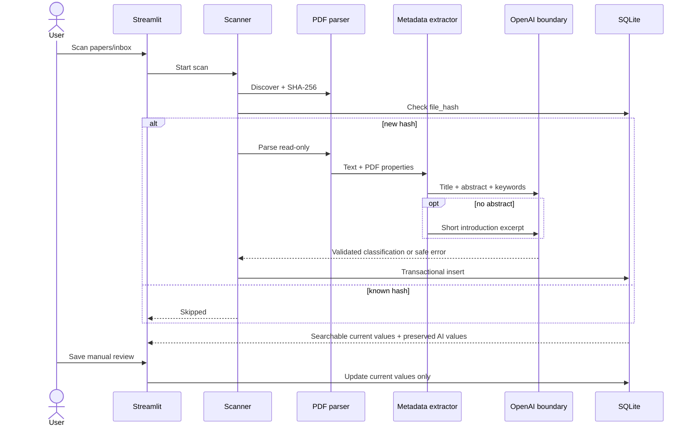

# Architecture

## Design goals

Version 0.1 is a local, inspectable classification pipeline rather than a general research platform. It prioritizes source-PDF integrity, deterministic duplicate handling, minimal data disclosure, recoverable AI failures, and explicit human authority over classifications.

## Components

| Component | Responsibility | Trust boundary |
|---|---|---|
| `src/config.py` | Resolve application-owned paths and environment settings; configure rotating logs | Reads secrets from local environment only |
| `src/pdf_parser.py` | Discover contained files, check signatures, hash content, extract bounded text | Parses untrusted PDFs locally, read-only |
| `src/metadata_extractor.py` | Recover conservative bibliographic fields and record their sources | Treats extracted text as untrusted data |
| `src/classifier.py` | Build minimal API input, request Structured Output, validate with Pydantic | Only component that sends paper-derived data externally |
| `src/database.py` | Own schema, transactions, bound SQL, search, and human-review updates | Persists private local research data |
| `src/scanner.py` | Orchestrate stages and isolate failures per paper | Does not mutate input files |
| `app.py` | Present dashboard, filters, detail, scan controls, and review form | User-facing local interface |
| `scripts/evaluate.py` | Compare reviewed ground truth with AI primary-category output | Reads an explicitly prepared local CSV |

## Data flow



The parser may inspect up to 12 pages locally to find front matter, abstract, keywords, and an introduction excerpt. The entire extracted text is never passed to the classifier. Abstracts are capped at 6,000 characters; introduction excerpts are used only when an abstract is absent and are capped at 2,500 characters.

## Database design

SQLite foreign keys are enabled for every connection. One insert and its label associations share a transaction.

### `papers`

The central table stores identity, bibliographic metadata, workflow state, processing diagnostics, and scalar classification fields. `file_hash` is a unique 64-character SHA-256 hex digest. Metadata lists that are not filter dimensions in v0.1 (`authors` and `keywords`) are stored as JSON arrays. `metadata_sources` is a JSON object because it is sparse provenance metadata rather than a search dimension.

Scalar AI/current pairs preserve provenance:

- `ai_primary_category` and `primary_category`
- `ai_relevance` and `relevance`
- `ai_relevance_reason` and `relevance_reason`
- `ai_relevance_confidence` and `relevance_confidence`

`manually_reviewed` distinguishes untouched AI output from a review. `classification_error` allows extraction results to survive an API or validation failure.

### Searchable many-to-many values

```text
papers 1---* paper_tags *---1 tags
papers 1---* paper_methods *---1 research_methods
papers 1---* paper_vulnerabilities *---1 vulnerabilities
```

Each junction row includes `value_source`, either `ai` or `current`. Initial classification creates both sets. Review replaces only current rows. This avoids opaque JSON filtering and supports future AI-versus-human evaluation without destroying history.

### Query behavior

All user values are bound parameters. Dynamic table and column identifiers are selected only from an internal constant mapping. Keyword search covers title, abstract, current tags, and current vulnerabilities. Facet filters use current reviewed values and “match any selected value” semantics.

## AI API boundary

The request includes only:

- title, capped at 500 characters;
- abstract, capped at 6,000 characters;
- at most 30 keywords;
- a 2,500-character introduction excerpt only if no abstract exists.

The OpenAI Python SDK's schema helper receives `ClassificationResult`, a Pydantic model with forbidden extra fields, enum-constrained primary category and relevance, bounded list sizes, a bounded explanation, and confidence between 0 and 1. The response is validated again before persistence. Provider exceptions are converted to an error containing only the exception type.

## PDF processing and source integrity

1. Resolve the candidate and inbox paths.
2. Reject paths that do not remain under the inbox after resolution.
3. Require a case-insensitive `.pdf` suffix and `%PDF-` magic bytes.
4. Stream the file through SHA-256.
5. Skip hashes already in SQLite.
6. Open with PyMuPDF in read-only mode and reject password-protected or malformed files.
7. Extract text in memory. Never save changes to the document.

PDF filename changes produce the same hash and remain duplicates. Two byte-identical PDFs in different folders also map to one record.

## Error handling

The scan loop has a paper-level exception boundary. A broken PDF, extraction exception, API error, refusal, rate limit, response validation error, or SQLite failure becomes a result row and the next PDF continues. A classification failure is non-fatal: metadata is stored with null classification fields and a safe diagnostic. A parse failure is not inserted because there is no trustworthy PDF record to present.

Rotating logs are local and ignored by Git. They deliberately omit API keys, prompts, abstracts, and document text. UI messages likewise expose sanitized exception classes rather than provider payloads.

## Security design

- Secrets enter through environment variables loaded from an ignored `.env` file.
- PDF input is data, never executable content.
- Source files have no write, move, rename, or delete code path.
- Path containment is checked after resolution to address traversal and symlink escape.
- File type is checked at multiple layers: extension, magic bytes, and parser acceptance.
- SQL uses parameters and foreign keys; the hash also has a database uniqueness constraint.
- External disclosure is minimized and bounded.
- Runtime data is ignored by Git, with `.gitkeep` files retaining empty directory structure.

## Deliberate v0.1 constraints

The design excludes OCR, background jobs, full-text translation, vector databases, semantic search, recommendations, citation graphs, automatic downloads, automatic file movement, and PDF editing. Adding these prematurely would expand the attack surface and obscure the core classification evaluation.
