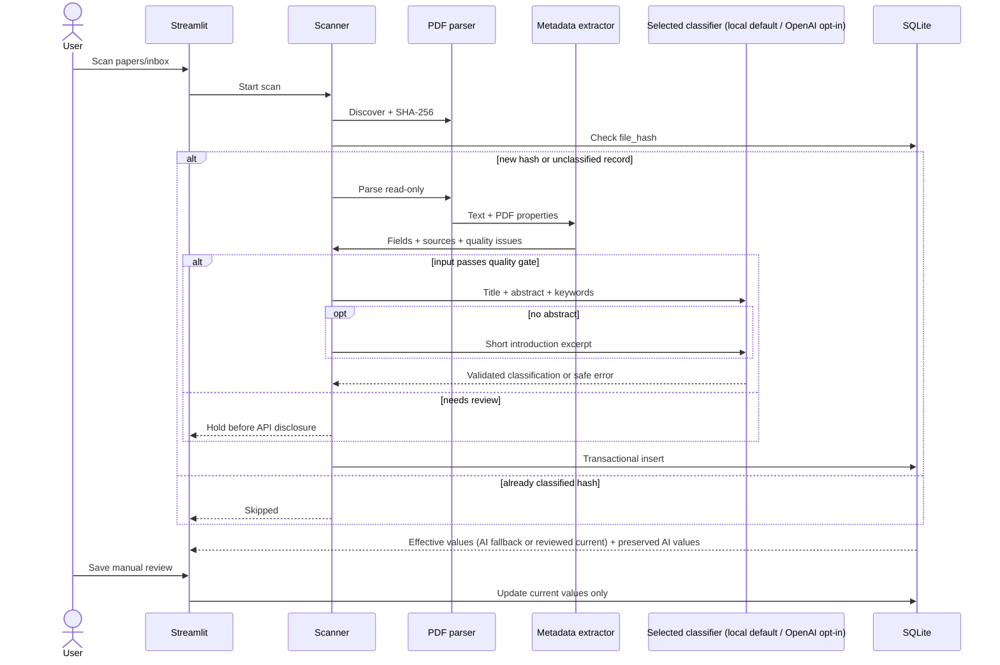

# Architecture

## Design goals

Version 0.1.1 is a local, inspectable classification pipeline. It prioritizes source-PDF integrity, deterministic duplicate handling, minimal data disclosure, recoverable AI failures, and explicit human authority over classifications.

## Components

| Component | Responsibility | Trust boundary |
|---|---|---|
| `src/config.py` | Resolve application-owned paths and environment settings; configure rotating logs | Reads secrets from local environment only |
| `src/pdf_parser.py` | Discover contained files, check signatures, hash content, extract bounded text and first-two-page block/line geometry and explicit publication properties | Parses untrusted PDFs locally, read-only |
| `src/pdf_access.py` | Locate a registered PDF by filename/hash, validate it, and open a file URI in the default browser | Contained local source files only; no serving or PDF writes |
| `src/metadata_extractor.py` | Recover conservative bibliographic fields, provenance, and review reasons | Treats extracted text as untrusted data |
| `src/bibliography.py` | Separate author rows from affiliations and recover evidence-backed publication year/venue | Local front matter and explicit properties only; no inferred names or publication facts |
| `src/classifier.py` | Common protocol, minimal input/prompt/schema, validation, factory and optional OpenAI provider | External paper disclosure only when OpenAI is selected |
| `src/ollama_classifier.py` | Local model preflight and JSON Schema requests with bounded retry | Loopback only; no cloud inference or model download |
| `src/database.py` | Own schema, transactions, bound SQL, search, and human-review updates | Persists private local research data |
| `src/scanner.py` | Orchestrate stages and isolate failures per paper | Does not mutate input files |
| `src/metadata_refresh.py` | Preflight an entire registered library, update metadata atomically, and retry only changed classification inputs | Read-only evidence first; hash/ID identity, verified backups and stale-state rejection |
| `src/i18n.py` | Translate UI text and enum display labels into Japanese, English, or Korean | Presentation only; never translates paper text or stored values |
| `app.py` | Present dashboard, filters, detail, scan controls, and review form | User-facing local interface |
| `scripts/evaluate.py` | Compare human labels with AI primary-category output and report accuracy / per-category metrics | Reads an explicitly prepared local CSV or successful run history and Human Review categories from SQLite in read-only mode |
| `scripts/refresh_metadata.py` | Explicit dry-run, metadata apply and targeted retry modes for the audited 40-paper library | Private evidence under ignored `data/`; no implicit write or classifier mode |

## Data flow



The parser may inspect up to 12 pages locally to find front matter, abstract, keywords, and an introduction excerpt. Only the first two pages retain block geometry, maximum span font sizes, line directions, and individual line geometry/text for author extraction. Mixed orientations are separated into distinct blocks; each retained block and line is bounded to 6,000 characters. These layouts are transient and do not change the database schema. Explicit PDF Info Year/PublicationYear/PublicationDate and PRISM publicationDate/coverDate or DCTERMS issued properties are also read locally. XMP is bounded to 128,000 characters and documents with DTD/entity declarations are ignored. Generic XMP dates and PDF creation/modification dates are not publication years. The entire extracted text is never passed to the classifier. Abstracts are capped at 6,000 characters; introduction excerpts are used only when an abstract is absent and are capped at 2,500 characters.

Title extraction retains the existing top-quarter first-page layout and PDF-property
priority, excluding rotated/vertical margin text, arXiv identifier labels,
proceedings headers, association branding, and clear internal document names
(workflow suffixes or document extensions). A valid PDF title remains the fallback
after usable layout candidates. If both fail, a proceedings-cover fallback requires the explicit
"This paper is included in the Proceedings of" text plus a USENIX conference URL
or Security Symposium label. Only then may it search the top half of the first
page and join overlapping, adjacent title lines. Its provenance is `first page
cover layout`. If a proceedings cover still has no usable title, the second page
must contain a usable title and an abstract/section heading before its layout is
accepted, with `second page layout` provenance. This also aligns abstract and author
extraction with the article page; publication year and venue still use the first page.
For modern proceedings covers, authors independently use the second-page title
region only when its title corroborates the recovered cover title. This route does
not change the Phase A abstract/keyword/introduction selection.

Bibliographic rules live in `src/bibliography.py`, separately from classification
input heuristics. Authors are read from horizontal lines between title and the
first abstract/section/unlabeled prose boundary, with a 300-point maximum region.
Line boundaries prevent institution prefixes from being appended to names.
Inline name/affiliation rows use the name before the first comma; institution,
contact and address rows are excluded. Markers, initials, Unicode accents,
surname particles and wrapped names are supported. A corroborated PDF Author
property keeps `PDF metadata` provenance; a differing or incomplete property is
superseded by usable article author rows with `first page layout` or `second page
layout` provenance. Valid author properties remain a fallback when no usable
article author region exists. Missing authors alone never hold classification.

Publication year candidates have explicit priorities: (4) journal volume/citation
and Published fields, (3) conference/proceedings headers or separate dates on an
identified proceedings cover, (2) explicit publication-year/date properties,
(1) copyright lines. Conflicting years at the highest available priority return
NULL, rather than choosing the most recent year. Submission, receipt, acceptance,
revision, retrieval/access dates, arXiv dates, and dates for an abridged/other
version are excluded. A Published field remains usable on a line that also lists
Received/Accepted dates. The sparse source map records journal/proceedings or
publication headers, proceedings dates, `PDF metadata`, and copyright lines.
NULL years have no fabricated source. Proceedings venues additionally distinguish
identified cover pages, ordinary headers and lower-page citation footers in the
existing string-valued source map.

Venues require a conference, workshop, proceedings or journal signal. Wrapped
USENIX/SOUPS headers, NDSS/ESORICS citation blocks and journal names followed by
a separate volume line are supported. Abbreviations are retained as printed;
publisher, institution, city and generic PDF Subject strings do not establish a
venue. Missing venues remain NULL. Bibliographic extraction has no external
lookup or provider calls and changes no storage contracts, AI originals, human
review values or classification quality-gate rules.

Abstract labels accept case variations and explicit delimiters. A standalone
`Summary` label or a delimited `Summary:`/`Summary—` label is also eligible before
body section headings; subsection names such as "Summary of the Recovery Phase"
are excluded. Adjacent blocks in the same column are joined to retain multiple
abstract paragraphs; centered section headings also stop that column. Paragraph
breaks do not end an abstract. Keywords, numbered sections, content warnings,
ACM classification fields, copyright/license notices, footnotes, and contact fields
are explicit boundaries. Unlabeled summaries require title geometry and prose before
the first section. When that section is on a later page, the first page must also
contain an author/affiliation region; contiguous summary paragraphs stop before
footnotes and the page footer. Introduction
fallback first retains the first-page routes, then searches the parser's bounded
text if necessary. It accepts standalone, Arabic-numbered (including split-line
numbers), and Roman-numbered headings, skips split table-of-contents entries
followed by page numbers, and stops at the next numbered section or an explicit
References/Bibliography/Acknowledgments heading. Later-page provenance is `bounded
PDF text fallback`. Contact, affiliation, footnote, copyright and margin-label
noise ends an introduction excerpt conservatively.

Keywords use explicit front-matter labels and their column layout, support wrapped
lines (including line-end hyphenation) and comma/semicolon/middle-dot separators,
and stop at the next field or section. Bounded-text keyword matches after body
sections are rejected, preventing response templates from being mistaken for
metadata. Valid explicit PDF `/Keywords` properties are a final fallback; missing
keywords are never inferred. Provenance remains field-specific.

The shared quality gate also rejects clear arXiv/internal/proceedings false titles.
A supplied unusable abstract cannot be rescued by an introduction that the provider
would not send. These are narrow input checks, not a guarantee of complete metadata
quality: missing authors/year, incomplete prose and plausible but incorrect values
still require audit. Classifier payload fields, prompts, provider/model settings,
and storage schema remain unchanged; extraction alone does not change persisted
metadata or classification status.

## Database design

SQLite foreign keys are enabled for every connection. One insert and its label associations share a transaction.

### `papers`

The central table stores identity, bibliographic metadata, workflow state, processing diagnostics, and scalar classification fields. `file_hash` is a unique 64-character SHA-256 hex digest. Metadata lists that are not filter dimensions in v0.1 (`authors`, `keywords`, and extraction review reasons) are stored as JSON arrays. `metadata_sources` is a JSON object because it is sparse provenance metadata rather than a search dimension. `introduction_excerpt` is retained so a pending classification can be retried without relying on a stale in-memory parse.

Scalar AI/current pairs preserve provenance:

- `ai_primary_category` and `primary_category`
- `ai_relevance` and `relevance`
- `ai_relevance_reason` and `relevance_reason`
- `ai_relevance_confidence` and `relevance_confidence`

`manually_reviewed` distinguishes untouched AI output from a review. Before the first explicit review, current scalar fields and current label rows remain empty; classification writes only `ai_*` fields and `value_source='ai'` rows. Read and search results expose effective values without persisting a copy: AI values are the display/filter fallback while `manually_reviewed=0`, and current values take over after a review save. AI retries update only AI-owned values and never overwrite current values. Initialization adds missing workflow columns and clears the old AI-to-current projection only for unreviewed rows; reviewed rows and all AI originals are preserved. `classification_status` records `pending`, `classified`, `failed`, or `needs_review`; pending and failed records can be retried when scanning the inbox again. A needs-review record is re-extracted and is only sent when its input passes the quality gate. `classification_error` allows extraction results to survive an API or validation failure.

### Initialization and legacy migrations

Initialization is physically idempotent for a fully migrated SQLite database:
repeated calls leave its bytes, size, header change counter, modification time,
schema and logical snapshot unchanged. The legacy scalar projection cleanup
updates an unreviewed row only when at least one editable column present in its
schema is non-NULL. Current-label cleanup deletes only existing `current` rows
belonging to unreviewed papers; AI labels and reviewed current values are retained.
Missing tables/indexes and workflow columns are still created, pending legacy
statuses are migrated when applicable, and legacy AI history is backfilled only
for papers with no existing classification run. These required migrations may
write on the first initialization; subsequent initialization performs no physical
change once migration is complete. Temporary-database regression tests compare
raw bytes/SHA-256, size, header counter, a fixed old mtime, and the complete logical
snapshot, including classification history.

### Processing duration

`papers.processing_seconds` is the wall-clock duration in seconds of the latest
non-skipped scanner attempt, measured with `time.perf_counter()`. Measurement starts
before hashing and the duplicate lookup and ends after parsing, metadata extraction,
the input quality gate, and any classifier preflight, generation and Pydantic
validation (including bounded validation retries). It excludes the subsequent
database writes, result logging and UI rendering. It is not classification-only
latency; no separate extraction/classification duration columns are introduced.

New inserts and existing-record retries use the same boundary. Successful, failed,
pending and review-held attempts save their current measured duration; skipped
classified hashes leave the previous duration and history unchanged. Duration and
the classification result/history append share the classification-write transaction.
The storage API accepts only finite non-negative durations. An omitted/None duration
on a direct `update_classification()` call preserves the existing value, while zero
is a valid measured value. No schema change or migration is required.

`classification_runs` continues to preserve original validated answers and failures;
it does not store per-run latency. `processing_seconds` describes the latest scan
attempt, which may have failed while the latest successful AI projection is retained.
Historical timings are not inferred or backfilled.

### Searchable many-to-many values

```text
papers 1---* paper_tags *---1 tags
papers 1---* paper_methods *---1 research_methods
papers 1---* paper_vulnerabilities *---1 vulnerabilities
```

Each junction row includes `value_source`, either `ai` or `current`. Initial classification creates only AI rows. Review creates or replaces current rows. Search, facets, and the dashboard select AI rows for unreviewed papers and current rows for reviewed papers. This avoids opaque JSON filtering and supports future AI-versus-human evaluation without destroying history.

### Query behavior

All user values are bound parameters. Dynamic table and column identifiers are selected only from an internal constant mapping. Keyword search covers title, abstract, effective tags, and effective vulnerabilities. Category, tag, method, vulnerability, and relevance filters plus dashboard counts use AI values until a human review exists, then use current reviewed values. The Human correction form starts empty for unreviewed papers; saving it is the only operation that creates current values and sets `manually_reviewed=1`. Filters use “match any selected value” semantics.

## UI language boundary

The compact language selector is the first sidebar control. Japanese is the initial
default; `ui_language` lives only in Streamlit session state and survives reruns.
`src/i18n.py` resolves UI text with English, then the key itself, as fallbacks.
PrimaryCategory, PaperStatus, and ClassificationStatus have display aliases;
unmapped labels retain their original text. Selectbox and multiselect options stay
canonical and use `format_func` for translated display. Stable widget keys preserve
filters, selected paper IDs, and review state when the language changes. Search and
review persistence receive canonical/original values, never translated enum labels.
On a language change, the UI re-publishes the existing enum widget values through
session state so the browser refreshes selected display labels as well as options.

Table and chart labels are translated at rendering time. Extracted titles, authors,
abstracts, keywords, free-form tags/methods/vulnerabilities, reasons, provider/model
identifiers, and original history/provenance JSON remain unchanged. Known fixed
scan/review messages are translated; unmatched diagnostics are shown verbatim.
Language selection makes no classifier call or database write. Schema, taxonomy,
prompts, AI/Human Review separation, Ground Truth, and evaluation are unchanged.
The existing CSS, five metric columns, and 2:1 detail/review columns are retained.

## Classification provider boundary

`ClassifierProvider` exposes provider, model, `classify(...) -> ClassificationResult` and `close()`. Scanner orchestration does not import provider clients. The factory defaults to local; OpenAI must be selected explicitly. `PaperClassifier` remains an alias of `OpenAIClassifier` for existing callers and mocks. Input gate, minimal payload, prompt, schema and output validation are shared. The local model name is configurable with no default in code.

The request includes only:

- title, capped at 500 characters;
- abstract, capped at 6,000 characters;
- at most 30 keywords;
- a 2,500-character introduction excerpt only if no abstract exists.

Before a request, title must look usable and either an abstract of at least 80 characters or a bounded introduction excerpt of at least 120 characters must exist. Extraction review reasons and obvious diagram/noise text hold the item at `needs_review`; missing keywords alone do not. The OpenAI Python SDK's schema helper receives `ClassificationResult`, a Pydantic model with forbidden extra fields, enum-constrained primary category and relevance, bounded list sizes, a bounded explanation, and confidence between 0 and 1. The response is validated again before persistence. Provider exceptions are converted to an error containing only the exception type.

Ollama `/api/chat` receives the same JSON Schema in `format`, with all fields required, `stream=false`, `think=false`, temperature 0, context 8192 tokens and output cap 1024 tokens. JSON is parsed and strictly validated with Pydantic; no fence removal, enum guessing, default filling or numeric-string coercion is performed. Only output validation failures permit 0 or 1 regeneration. Transport, HTTP and model errors are not retried. The default local timeout is 180 seconds (configurable up to 600); OpenAI transport retries are disabled with a 60-second timeout.

### Local privacy

**Local Providerでは論文情報がPC外へ送信されない。** Only HTTP loopback addresses are accepted; localhost is normalized to a literal address. URL credentials, paths, queries and fragments are rejected. The HTTP client ignores proxy settings and does not follow redirects. Cloud model references and `/api/show` responses with remote_host/remote_model are rejected before paper submission; installed local model metadata must be present. The app performs no downloads, external fallback or tool invocation.

Run the trusted local Ollama server with `OLLAMA_NO_CLOUD=1` and restart it after changes. An app `.env` entry alone does not configure an already running server. Installation, model downloads and software updates can use the network separately; paper classification stays local.

### Additive provenance migration

Nullable papers columns `classification_provider` (local/openai), `classification_model`, and `classified_at` describe the latest successful ai_* projection. A failed retry changes workflow state without attributing an older success to the failing provider.

New `classification_runs` rows retain provider/model, validated result JSON or sanitized failure, UTC classification time for successes, and creation time. Run insertion, latest AI update and labels share a transaction. Retries replace the latest AI projection but retain all previous originals in history; Human Review never edits that history or gets overwritten by retries. Existing AI rows are snapshotted once, with unknown historical provider/model/date left null. Old failures keep their diagnostics without invented provenance. Migration is idempotent.

Normal scans skip classified hashes regardless of provider changes. Explicit `reclassify=True` enables deliberate comparison runs. Evaluation reads successful history and current human labels read-only, groups by provider/model, and uses the latest success per hash per group. The original CSV metrics remain available. Human Review categories are not automatically independent Ground Truth; evaluation references require a fixed rubric and separate human judgment. The multi-field v0.1.1 pilot in [EVALUATION_RESULTS.md](EVALUATION_RESULTS.md) used local helper scripts; the public CLI evaluates primary category only.

### Controlled metadata refresh

The regular scanner retries existing records through metadata and classification
writes. Its `update_metadata()` also updates classification status/error, and its
paper-level failure boundary can leave a partial library refresh. It therefore
is not the entry point for applying extractor improvements to classified papers.
The controlled workflow is separate; normal scan behavior and migrations remain
unchanged. No schema additions are required.

Close Streamlit and other database users before running the controlled CLI. It
requires an existing, quiescent SQLite database with no WAL, SHM or journal
sidecars. It rejects sidecars rather than deleting them or checkpointing the DB.
Read-only snapshots use `mode=ro&immutable=1` and `query_only=ON`, with physical
SHA-256/size/mtime checks before and after. Immutable mode is used only with this
quiescence requirement. The CLI never calls `Database.initialize()`; existing
migration same-value UPDATE behavior is outside this workflow's scope.

```powershell
python -m scripts.refresh_metadata --dry-run
```

Dry-run locally reparses every PDF and extracts metadata without creating a
classifier, loading provider settings, creating logs or opening a writable DB.
Every `.pdf` candidate is checked, including malformed candidates the ordinary
scanner would skip. Resolved containment, signature, count, unique SHA-256 and
the complete DB/inbox hash sets must agree. Filenames are descriptive; ID plus
hash identifies a paper. Renamed files can match by hash; unknown, changed,
duplicate or missing PDFs block apply. PDF SHA-256, size and mtime are checked
again after extraction. Exceptions expose only paper IDs and exception types.

The CLI requires 40 papers and independently derives the changed-input set by
exactly comparing title, abstract, keywords and introduction excerpt against the
stored metadata. The audited manifest freezes the derived expected count and set.
It cross-checks `phase-a-report.md`, `phase-a-final.json`, `phase-b-final.json` and
`phase-a-protected.json` under local `data/metadata-audit-40/`: all original inputs,
IDs, filenames and PDF hashes must agree, Phase A outputs must agree with Phase B
inputs/outputs in all 160 input fields, and today's extractor must agree with
Phase B. Any mismatch or new extractor review/input issue prevents apply.
Bibliographic and provenance changes alone never create retry targets.
Phase A primary and secondary scopes come from the audit evidence, rather than
an ID allowlist. The evidence checks each stored old input against Phase A old,
Phase A new against Phase B old/new, and the current extraction against Phase B
new: 160 fields at each boundary. The complete changed-input set is derived from
all four fields for every paper. Primary scope is not the expected candidate set.

`src/refresh_manifest.py` freezes a PDF-reviewed observation under ignored
`data/metadata-refresh/refresh-manifest.json`. It records corpus size, DB IDs,
physical DB hash/size/mtime and logical snapshot hash, every PDF hash/size/mtime,
metadata-changed/input-changed/bibliographic-only sets, per-paper identity,
old/new full-metadata hashes and four input-diff flags, phase evidence hashes,
UTC timestamp, base commit, and working source hashes (including uncommitted
extractor, parser, storage and guard changes). Matching IDs alone cannot pass.

Every raw candidate needs an explicit A/B/C decision, source page and evidence.
A means an intended substantive improvement and a retry target. B is a reviewed
format-only change; a narrow equality check permits whitespace, an orphan initial
Abstract-heading period, and splitting middle-dot keywords while preserving
word content, case and order. Removing Content Warning, ACM classification or
footnote words is substantive under this policy. C blocks freezing. This policy
judges metadata content; it does not claim identical future model outputs.
The freeze factory is separate from the CLI and is called only after PDF review.
Reclassification IDs are derived from A decisions; all raw diffs remain recorded.

The CLI requires the frozen manifest and its independently reviewed canonical
SHA-256 for either write mode. A fresh read-only dry-run with that manifest must
match the entire observation and source identity before the plan is bound to its
digest. An unbound dry-run remains diagnostic (`production_write_ready=false`).
A changed corpus, same-ID value change, missing/extra candidate, audit/code drift,
unchecked format exception, or stale digest rejects before backups or DB writes.
A source change or later commit requires a new freeze and reviewed dry-run.
Generic library calls without a manifest retain the original all-raw-diffs retry
behavior for compatibility; they cannot use any format-only exclusions. The
production CLI always requires a bound manifest and count 40.

Local evidence uses exclusive, timestamp/UUID names under ignored
`data/metadata-refresh/`. The baseline records paper fields except absolute
filepath, raw AI/current label values and every classification run. This is
preservation evidence; AI results are not used to judge metadata correctness.
The plan stores bounded old/new metadata and ID/hash pairs. The readable report
contains change flags and review reasons, without paper bodies or absolute paths.
Neither the evidence nor any research data belongs in Git.

The later, explicitly requested write steps are:

```powershell
python -m scripts.refresh_metadata --apply --plan data/metadata-refresh/REVIEWED-plan.json --manifest data/metadata-refresh/refresh-manifest.json --manifest-sha256 REVIEWED_DIGEST
python -m scripts.refresh_metadata --reclassify --provider local --plan data/metadata-refresh/REVIEWED-plan.json --receipt data/metadata-refresh/APPLIED-receipt.json --manifest data/metadata-refresh/refresh-manifest.json --manifest-sha256 REVIEWED_DIGEST
```

Metadata apply repeats the full read-only preflight and extraction, checks the
reviewed plan digest and evidence, then opens one `BEGIN IMMEDIATE` transaction.
The controlled writer uses `mode=rw` on an existing DB and refuses file creation.
It checks the complete logical DB snapshot under the write lock, checks PDFs
again, and creates a byte-exact, fsynced backup with exclusive file creation in
`data/backups/`. Backup names use UTC timestamp plus UUID; an existing file is
never overwritten. Backup SHA-256 must match the baseline. With no WAL and the
reserved write lock held, copying the source file captures a consistent DB.
Backup failure prevents writes. A backup is retained if a later write rolls back.

Only changed metadata rows are updated, using parameters and an ID/hash WHERE
clause. Allowed columns are title, authors_json, year, venue, abstract,
introduction_excerpt, keywords_json, metadata_sources_json and
metadata_review_reasons_json, plus updated_at. AI fields/labels, human/current
fields/labels, manually_reviewed, status, classification_status/error,
provider/model/time/duration, created_at, identities, and every history row remain
exactly equal. A full snapshot comparison checks these invariants before commit,
including effects of triggers. Any failure rolls back all metadata changes.
The apply receipt binds the plan digest to the resulting full DB snapshot and
the backup filename. There is no classification call during apply.

Targeted reclassification requires that receipt, the unchanged applied snapshot,
unchanged PDFs, exact refreshed metadata and the verified original backup. Old
inputs are checked against the backup so altered plans cannot invent historical
changes. Only the manifest-derived substantive A ID/hash pairs from that plan are submitted, through
the existing provider protocol. Payloads contain title, abstract and keywords;
the bounded introduction excerpt is provided only when the abstract is absent.
No bibliography, paths, hashes, human labels or PDF bodies reach the provider.

Generation occurs before a write lock. The entire receipt-bound DB state is
checked again under `BEGIN IMMEDIATE`; a concurrent review or scan discards staged
results rather than overwriting it. Another verified backup precedes persistence.
All targeted attempts are committed in one batch using the same classification
writer as normal scans. Success replaces only the latest AI projection and
provenance and appends a run; failure appends a sanitized failed run and retains
the previous successful AI values/provenance. Human/current values, review flags,
reading status, metadata, previous history and all non-target papers are verified
unchanged before commit. The receipt cannot be replayed after a batch changes the
DB. Failed targets require a new reviewed recovery plan; there is no automatic
retry or restart of all 40 papers. External provider calls already made cannot
be rolled back if a concurrency or persistence check later rejects the batch.

For recovery, retain both the original plan/receipt and backups. With all DB users
closed, review the relevant verified backup before any separately authorized
restore; the workflow never automatically restores or deletes research data.
The local receipt is the required continuation artifact. If evidence output
fails after commit, preserve the DB/backup and inspect the state before proceeding.

## PDF processing and source integrity

1. Resolve the candidate and inbox paths.
2. Reject paths that do not remain under the inbox after resolution.
3. Require a case-insensitive `.pdf` suffix and `%PDF-` magic bytes.
4. Stream the file through SHA-256.
5. Skip hashes already classified in SQLite; retry pending, failed, and review-held rows.
6. Open with PyMuPDF in read-only mode and reject password-protected or malformed files.
7. Extract bounded text and first-two-page layout/direction in memory. Never save changes to the document.

PDF filename changes produce the same hash and remain duplicates. Two byte-identical PDFs in different folders also map to one record.

### PDF quick access

Paper Detail places a localized "Open PDF in default browser" button just below
Authors/Year/Venue. On a
click, `src/pdf_access.py` first tries `settings.inbox_dir / filename`. Because
the scanner stores a basename even for nested PDFs, it falls back to recursively
matching basenames under the current inbox. Each candidate must match the existing
`file_hash` (SHA-256), so duplicate basenames cannot select another paper. The
stored absolute `filepath` is neither used nor changed; moving the project with
its inbox does not invalidate this lookup. A renamed or changed source fails
safely until its registered identity can be found again.

Filename/hash values are validated at the boundary. Candidates must exist as
regular files, have a case-insensitive `.pdf` suffix and `%PDF-` signature, and
remain inside the resolved inbox, including after symlink/junction resolution.
Containment is checked before reading or hashing a candidate. The matching,
resolved path is converted with `Path.as_uri()` and passed once to
`webbrowser.open_new_tab()`. A false return or exception produces a fixed,
localized warning without absolute paths or underlying exception text. The UI
no longer displays the stored local absolute path.

This opens the source PDF in the local environment's default browser without
requesting a particular browser. It is a local-only convenience for Streamlit,
the default browser, and PDFs on the same PC. `webbrowser` acts on the server's
PC; remote/cloud deployment cannot use it to open the client's browser. The
browser/OS controls the final PDF handler and whether it uses a tab or window;
the UI does not promise a new tab. A true return confirms dispatch rather than
PDF rendering.
No HTTP file server, upload, download, schema change, classification call, or
review/history write is part of this action.

## Error handling

The scan loop has a paper-level exception boundary. A broken PDF, extraction exception, API error, refusal, rate limit, response validation error, or SQLite failure becomes a result row and the next PDF continues. A classification failure is non-fatal: metadata is stored with null classification fields and a safe diagnostic. A parse failure is not inserted because there is no trustworthy PDF record to present.

Rotating logs are local and ignored by Git. They deliberately omit API keys, prompts, abstracts, and document text. UI messages likewise expose sanitized exception classes rather than provider payloads.

## Security design

- Secrets enter through environment variables loaded from an ignored `.env` file.
- PDF input is data, never executable content.
- Source files have no write, move, rename, or delete code path.
- Path containment is checked after resolution to address traversal and symlink escape.
- File type is checked at multiple layers: extension, magic bytes, and parser acceptance.
- SQL uses parameters and foreign keys; the hash also has a database uniqueness constraint.
- External disclosure is minimized and bounded.
- Runtime data is ignored by Git, with `.gitkeep` files retaining empty directory structure.

## Folders and Notes

The UI presents user-defined organization as Folders / フォルダ. The sidebar
provides New Folder, a folder list with All Papers, and folder management with
rename and deletion. Paper Detail provides a multi-folder selector with an
explicit Save folders action, and a separate plain-text Notes editor with Save note.
Deletion requires a checkbox naming the target folder. Names remain user text;
they are not translated or rendered as HTML.

Additive `CREATE TABLE IF NOT EXISTS` initialization creates `folders` (id, name,
unique name_key, created_at, updated_at), `paper_folders` (paper_id, folder_id,
composite primary key), and `paper_notes` (paper_id primary key, content, updated_at).
Membership foreign keys cascade when the folder is deleted; paper records are
never deleted by folder management. Existing Favorite / Read Later storage and
operations remain in `paper_user_state`.

Names are trimmed, bounded to 100 Unicode codepoints and reject blanks/control
characters. The unique name_key uses NFC-normalized Python casefold rather than
SQLite's ASCII-only NOCASE to reject Unicode case-insensitive duplicates. Updates
retain stable folder IDs. Positive SQLite-sized IDs and note text up to 10000
characters (without NUL) are validated at the repository boundary. SQL values
are parameterized. Membership replacement validates the paper and all requested
folders in one write transaction before replacing links; an invalid target rolls
back the complete operation. Folder filters use EXISTS and combine with every
existing filter without duplicating rows.

Folder writes affect only folder definitions/memberships; note writes affect only
paper_notes. Neither changes paper timestamps, source PDFs, flags, AI originals,
classification history, or human review. Empty notes can be saved to clear content;
reading an absent note returns an empty string without inserting a row. Saving
identical content does not update its timestamp. Hydrated paper records expose
folders and note separately from user_state and classification.

The controlled refresh snapshot includes these tables when present, while remaining
compatible with read-only databases predating the feature without initialization.
Metadata preservation and retry preservation checks protect personal organization
tables. Existing frozen refresh manifests must be regenerated and reviewed after
this schema/source change, as their full schema and source identity no longer match.
Folder names, memberships and notes stay local and never enter classifier payloads.


## Deliberate v0.1 constraints

The design excludes OCR, background jobs, full-text translation, vector databases, semantic search, recommendations, citation graphs, automatic downloads, automatic file movement, and PDF editing. Adding these prematurely would expand the attack surface and obscure the core classification evaluation.

## Frozen artifact evaluation

`scripts/evaluate.py` retains the CSV category and read-only database comparison paths. Its separate frozen mode delegates to `scripts/evaluation_v1.py`: explicit freeze manifest + approved GT + split-v1 + protocol-v1 JSON inputs → identity/role validation → IDs 9–40 join by ID/hash → normalization-v1 derived sets → deterministic five-field metrics on stdout. It never accesses application services, SQLite or network providers and does not initialize storage. The production schema and classification/review flow are unchanged.

Canonical human values are copied into ignored local GT artifacts, independently of the immutable original AI predictions in the freeze. Development IDs 1–8 reuse historical reviewed values; heldout IDs 9–40 retain human-approved AI-assisted draft values without reinterpretation. Protocol, source, GT and split digests are fixed before scoring. Derived normalization never overwrites either source. Private orchestration stores ignored reports, confusion/per-label CSVs, preservation evidence and an independent cross-check. Only methodology, aggregate results and reproducibility identities enter public documentation.

See [EVALUATION.md](EVALUATION.md#locked-heldout-evaluation-dataset-v1) for fixed class orders, zero-division/empty-set rules, documented blinding limits and the no-heldout-tuning rule.

## Favorite / Read Later user state

`paper_user_state` stores local, user-managed flags separately from AI tags,
classification, Human Review, Ground Truth, and the existing reading status.
`paper_id` is the primary key and references `papers(id)` with cascading deletion;
`is_favorite` and `read_later` are independent NOT NULL integer booleans, defaulting
to 0 with CHECK constraints. UTC `created_at` / `updated_at` record state writes.

Normal `Database.initialize()` adds the table using CREATE TABLE IF NOT EXISTS.
No backfill is needed: absent rows read as false/false and are created only on an
explicit state write. Existing initialization migrations retain their prior
behavior; adding this table does not update papers, labels, reviews, or history.
Repeated initialization preserves flags and does not rewrite an initialized DB.

The repository validates positive integer paper IDs and strict boolean flags,
uses parameterized upserts, and changes only supplied flags. Repeating the same
values leaves timestamps and the DB unchanged. `get_user_state`, `set_user_state`,
`set_favorite`, and `set_read_later` own access. Hydrated papers carry a separate
`user_state` object. Search uses EXISTS predicates; enabling both user-state
filters means AND, combined with all existing filters. Complete logical snapshots
include the table when present so controlled metadata refresh preserves user
state and rejects stale plans after a flag change; older DBs remain readable.

The list retains its existing table with only the Favorite / Read Later checkbox
columns editable. Its callback maps rendered row positions to captured paper IDs
and writes only the changed flags before rerendering. A new editor baseline after
each write prevents replaying old edits. Detail toggles use the same repository,
refresh from persisted values, and remain outside the Human Review form. Filtered
papers disappear immediately when a flag is cleared. Japanese, English, and Korean
labels use `src/i18n.py`. Reloads and new sessions read the SQLite state. These
operations never construct a classifier, scan PDFs, or make model requests.
