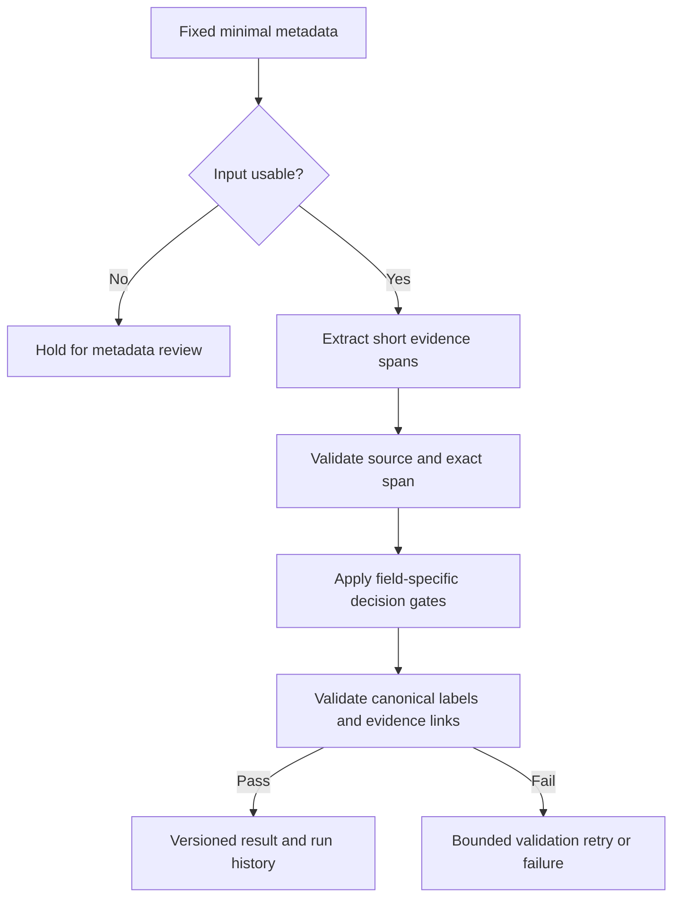
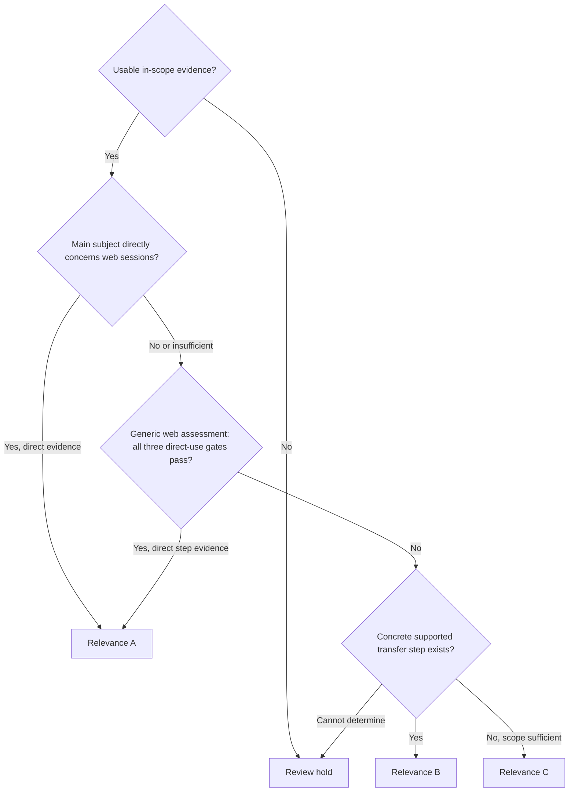

# Classifier v2 Development Plan

計画版: `classifier-v2-plan-v1`。設計固定日: 2026-10-04（Asia/Tokyo）。

**状態: 設計・Development計画を固定。Classifier v2は未実装・未実行・未freeze。** 本書の採用方針、収集条件、試行上限、昇格条件は次フェーズの開始前仕様である。コード、Prompt、DB、評価成果物を変更する指示を今回実行するものではない。設計変更が必要になった場合は、変更理由と版を残し、Test Corpusへのアクセス前に別計画として承認・固定する。

## 1. Background

Classifier v1の正式評価は完了している。Evaluation Dataset v1のIDs 1–8はdevelopment / historical tuning、IDs 9–40の32本は正式heldoutであり、両者を合算しない。以下は[Evaluation Results](EVALUATION_RESULTS.md#evaluation-dataset-v1-formal-heldout-evaluation)の公開aggregateのみである。

| Field | Accuracy / Exact Match | Micro F1 | Macro F1 |
|---|---:|---:|---:|
| Primary Category | 0.750000 | 0.750000 | 0.767956 |
| Relevance | 0.093750 | 0.093750 | 0.170370 |
| Tags | 0.000000 | 0.288401 | 0.150527 |
| Research Methods | 0.156250 | 0.285714 | 0.118162 |
| Target Vulnerabilities | 0.437500 | 0.177778 | 0.095960 |

このaggregateは改善優先順位の根拠にする。Primaryは比較的良好だが、Relevance Aの過大判定、TagsとVulnerabilitiesの過剰付与、Methodsの不足付与が課題である。個別heldoutの本文・予測・GT・誤りを本書の例やdecision ruleには使わない。以下の概念例は依頼された一般的な境界とRubricの定義に基づく合成例であり、実在のheldout論文を表さない。

根拠となる現行仕様は[Architecture](ARCHITECTURE.md)、[Evaluation](EVALUATION.md)、[Rubric v1](EVALUATION_RUBRIC.md)、[Results](EVALUATION_RESULTS.md)、[README](../README.md)、[Local LLM](LOCAL_LLM.md)と実際のsourceである。外部検索、論文検索、ダウンロード、モデルへの問い合わせは設計作業に含めない。

## 2. v1 Baseline

### 2.1 Immutable baselineの範囲

baseline source commitは`e099555333660f497360e7e0e7155480784a227e`。設計開始時にmain、origin/main、remote mainの一致とtracked/staged cleanを確認した。v1をv2で上書きしない。以下をimmutableとして保全する。

- classifier Prompt、provider、model、全inference parameters、Structured Outputとvalidation、taxonomy、normalization。
- original 40 PDF、保存メタデータ、production DB、既存AI originals、Human current値、全historical classification runs。
- Evaluation Dataset v1、GT v1、split-v1、freeze manifest、frozen predictions、protocol、正式heldout結果。

本計画固定時の読み取り専用確認では、production DBのpapersは40件、classification_runsは72件、inboxのPDFは40本。これは今回の保全確認値であり、将来の新規Development/Test分類を既存production DBへ追記してよいという意味ではない。

### 2.2 Baseline identities

| Identity | 固定値／定義 |
|---|---|
| Source commit | `e099555333660f497360e7e0e7155480784a227e` |
| Frozen prompt canonical SHA-256 | `b9b7fdddae0c1375de55b9cf8d55d7f83dd6a202ef5fe36c3674132010fda4dd` |
| SYSTEM_PROMPT UTF-8 SHA-256 | `cc063dea4ef57d1677220bb6667c5cf3ce1fa1c5ade0010e4b515dfcd276feb8` |
| Model digest observed at v1 freeze | `359d7dd4bcdab3d86b87d73ac27966f4dbb9f5efdfcc75d34a8764a09474fae7` |
| Dataset v1 content digest | `2852837d2aeccc8671ad76a28173fdc063e8c8dbccb93dc4562972c8715748db` |
| Approved GT v1 content digest | `3bea5bba3f3b88c2d0086d66f029952da426828d66b94b468c84be487da4d883` |
| Split v1 content digest | `3dfbc9c0bc45479a17b65901c2fbf4d4df113ee28446444a5f0bd4771104aa54` |
| Frozen AI predictions, 40 papers | `0ad0cb62ba7248a2a505a97f2e03b2ecd175dbcf6978f67a9ae4a677cf8e5ce0` |
| Rubric v1 file SHA-256 | `e49ae70b8d48a1febf25c719f9df8c35cd4dbeff3b263c45c038a78de84da5ce` |

Frozen promptのdigestはfreeze manifestの`content.code_identity.prompt`のcanonical JSONに対するもの。local用system内容、response schema、user prefix、payload encoding、validation retry文を束ねる。SYSTEM_PROMPT単体のdigestとは入力範囲が違うため同一値にはならない。v2でもsystem文だけのhashで全Prompt identityを代表させない。freeze情報の確認は非paper metadataに限定し、`papers`や個別predictionを表示しない。

model digestはfreeze時点の観測であり、過去の全runで同じmodel binaryが使用されたことは証明しない。現在のhistoryはrunごとのdigestを持たない。新規corpusでのv1再実行には、この観測digestと一致するローカルmodelを事前確認し、実行時digestを新たに記録する。取得不能／不一致なら別modelに置換せず、公平比較を保留する。

### 2.3 現行実装との接続

| Source | 確認した現行契約 | v2で必要となる将来作業 |
|---|---|---|
| [classifier.py](../src/classifier.py) | `ClassifierProvider`、`SYSTEM_PROMPT`、`classification_messages()`、`classification_schema()`、`validate_classification_json()`、共通factory | v1経路を保持し、明示version選択と独立v2経路を追加 |
| [ollama_classifier.py](../src/ollama_classifier.py) | loopback限定、schema付きJSON、local preflight、validation再生成は最大1回 | v1設定を維持し、v2 schema／Evidence validationを独立適用 |
| [models.py](../src/models.py) | `ClassificationResult`、`ClassificationProvenance`、8分類／A・B・C | 現行modelを保持し、別名v2 envelopeを追加 |
| [database.py](../src/database.py) | AI/current分離、append-only history、`result_json`はvalidated classification、provider/modelのみのrun provenance | version identityとEvidenceの付加historyを導入。既存行は編集しない |
| [config.py](../src/config.py) | default providerはlocal、model名にコード上のdefaultなし | 実験設定を明示固定し、production設定を暗黙変更しない |
| [evaluate.py](../scripts/evaluate.py) | CSV／DB経路はPrimary中心、DBはprovider/model別の最新成功runを選ぶ | 同provider/modelのv1/v2比較には使わず、明示identityのartifactを評価 |
| [evaluation_v1.py](../scripts/evaluation_v1.py) | 固定IDs 1–40、splitとprotocolを厳格検証し、9–40のみoffline採点 | metric関数の意味を保持する独立v2 harnessが必要。現行v1 evaluatorを改変しない |

将来はv1の実行用source capsuleと設定を固定し、v2 candidateを別versionとして実行する。新規corpus上のv1 predictionは新しいrun artifactであり、v1の旧frozen predictionを再生成・置換するものではない。実験はproductionと分離したignoredローカルartifact／実験DBで行う。

## 3. Goals

| 優先順位 | 改善対象 | 設計方針 |
|---|---|---|
| 1 | Relevance | A/B/Cを明示gateで判定し、Aの直接性とBの具体的転用工程を要求 |
| 2 | Tags | 主要概念の明示Evidenceだけを採用し、過剰展開を抑制 |
| 3 | Research Methods | 実施行為を回収し、技術名や背景からの推定を抑制 |
| 4 | Target Vulnerabilities | 直接研究対象と被害・一般脅威を分離 |
| 5 | Primary Category | 対象優先の既存原則を維持し、境界を明文化して非劣化を重視 |

最初の比較で測るのは、同一modelと設定でのclassification procedure / Prompt / Evidence disciplineの変更効果。Evidence envelopeとそのvalidatorはこの手続き変更に必要な一つのbundleである。v2.0の全体差から個々の規則だけの因果効果を断定せず、後続iterationは一つの仮説に絞る。

## 4. Non-goals

今回作成・変更する成果物は本書だけ。Prompt実装、runtime／provider／schema／evaluator／test変更、schema migration、DB更新、AI分類、再分類、metadata refresh、PDF import、論文収集、GT作成、v2 freeze実行は行わない。provider requestsはOllama preflightを含め0。

v2初期版でもmodel upgrade、taxonomy変更、normalization変更、全文分類、translation、semantic search、recommendations、citation graphs、自動PDF downloadは対象外。model upgradeは独立experiment、taxonomyの再編はClassifier v3候補、normalization-v2はfuture proposalに分ける。

`papers/inbox/`はimmutable user data。既存untrackedの`docs/images/`と`paper-download-bundle-02/`は操作対象外。private PDF、GT、prediction、SQLite、logs、`.env`、paper identity一覧をGitへ追加しない。

## 5. Leakage Policy

### 5.1 Corpusごとの許可範囲

| Corpus | 許可 | 禁止 |
|---|---|---|
| v1 IDs 1–8 | historical tuningとしての位置付けを説明 | 新規Development/Test v2への再収録。本計画では個別例を持ち込まない |
| v1 heldout IDs 9–40 | 公開aggregateを優先順位と限界の根拠に使う。duplicate防止用identityをローカル機械照合 | 個別prediction／GT／error／title／abstract／label differenceをPrompt、few-shot、rule例、development exampleへ利用。tuningの再実行 |
| Development Corpus v2 | GT freeze後、candidateの誤りを限定iteration内で調整 | predictionによるpaper採否、predictionに合わせたGT変更、test scoreとしての宣伝 |
| Test Corpus v2 | classifierとGTのfreeze後、両versionを同一集合で一度比較 | 結果を見たv2調整、paper差替え、label alias追加、同testでの再promotion |

duplicate確認では旧corpusのpaper情報をPrompt担当へ展開しない。隔離されたidentity registryを照合し、担当者へcandidateのduplicate可否だけを返す。これはtuning利用ではない。本設計で旧heldoutの個別内容を例として使用した件数は0。

### 5.2 作業境界

selection担当とGT担当の作業用入力には、v1/v2 prediction、AI reason、Confidence、run history、既存AI/Human UI projectionを含めない。AI draft作成用ツールにも同じ制限を適用する。artifact全体を表示して後から列を隠す方法ではなく、最初からallowlistでreview packetを生成する。

担当者が1名でも、選定→GT freeze→prediction生成／閲覧を時系列で分離する。AI draft担当のchat／tool contextにはcandidate predictionを載せず、過去のpredictionを含む作業履歴をforkしない。view/import/access記録、担当、日時、対象版をprivate auditへ残す。UIのAI fallbackをGTと誤認しない。

predictionへの露出があった場合は、内容・時点・対象・原因を記録し、strict blindingを主張しない。GT freeze前なら独立した未露出reviewerによる再review、または新規の未露出paperでやり直す。Test predictionの開封後に露出やGT不備が判明した場合は正式評価の独立性を保留し、v2の調整に利用しない。

## 6. Taxonomy / Normalization

### 6.1 維持する版と設定

| 項目 | v2初期版の固定方針 |
|---|---|
| Provider | `local`、Ollama、loopbackのみ |
| Model | `qwen3:4b`、v1 freeze観測digestと同じbinary |
| Inference | `temperature=0`, `think=false`, `num_ctx=8192`, `num_predict=1024`, `stream=false` |
| Transport / validation | timeout 180秒、validation再生成は最大1回。transport／HTTP失敗に自動再試行なし |
| Hardware premise | 16GB RAM、i7-1255U、CPU inference、並列generationなし |
| Primary taxonomy | 現行8分類。便宜上のidentity名`primary-taxonomy-v1`は新規alias／enum変更を意味しない |
| Rubric / evidence semantics | `rubric_version=v1`、本書は判定手続きの明文化。GTの意味を変更しない |
| Evaluation normalization | `normalization-v1`を両側に同じように適用 |

temperature 0でも同一出力は保証しない。model tagだけでidentityを確認せず、digest、runtime version、環境を記録する。予測とGTには同一の固定extracted inputを使用し、iteration間に再抽出しない。

### 6.2 normalization-v1の維持

前後／連続空白整理、フィールド別の既存完全一致alias、canonical文字列の完全一致重複排除のみ。既存aliasはTags / VulnerabilitiesのCSRF表記群とSQLi / SQL Injection、Tags / MethodsのBlack box testing / Black-box Testing表記群。正確な辞書は[Rubric §7](EVALUATION_RUBRIC.md#7-normalization-v1)と`normalize_labels()`をauthorityとする。

未登録語のcase、親子概念、原因／結果は保持する。IDORとBOLA、Session FixationとSession Hijacking、Machine LearningとReinforcement Learningは統合しない。評価時だけのalias拡張、fuzzy／semantic matching、余分なAI labelの削除は禁止。raw、validated、normalized-derived値を区別する。

現行Pydanticの`_deduplicate()`は空白整理とcasefold重複除去を行う。DB label辞書にも`COLLATE NOCASE`がある。これらは保存時挙動であり、評価のnormalization-v1で全ラベルを小文字化する根拠にはならない。v1 adapterを変更せず、v2でもraw responseを別保存し、canonical projectionに適用する処理と評価正規化をそれぞれidentityへ含める。

future proposalとして、open vocabularyの表記ゆれ辞書の追加や全field共通表記方針を研究できる。採用するなら別normalization版・別experimentとし、今回のv2初期比較へ混ぜない。

## 7. Evidence-first Design

### 7.1 入力から分類まで

許可入力はtitle（現行上限500文字）、abstract（6,000文字）、keywords（最大30項目）。abstract欠落時だけintroduction excerpt（2,500文字）を使う。正常abstractとexcerptを同時に追加しない。本文にだけある概念を自動補完しない。現行quality gateのusable title、abstract最低80文字／fallback excerpt最低120文字などを保持する。

入力範囲が正常で、あるmulti-label fieldに肯定Evidenceがなければ`[]`を許す。抽出不良、主要対象の判定不能、Relevanceの判定不能は空集合やC／Other Securityで埋めずreview holdにする。

1回の生成内で短いEvidenceとlabelを出し、ローカルvalidatorでsource／span／link／gate整合性を検証する。段階化は長い思考過程を保存することではない。system/user instruction、paper metadata、model outputはそれぞれ別trust boundaryとして扱い、metadata内の命令やschema変更要求を実行しない。

### 7.2 Evidenceの採否

Evidenceは、許可sourceからの短い**連続した原文span**と、支持概念、役割、direct / indirectの記録。日本語訳、paraphrase、省略記号で接合した非連続引用はspanとして認めない。keywordsは該当項目のindexを検証する。source文字列は実際にmodelへ送ったbounded payloadをauthorityとする。

validatorはexact substring、source availability、ID参照、出力enum、型、長さ、空文字、finite数値を検証する。Methods / Vulnerabilitiesをtitle／keywordsだけで支持するlink、abstractがあるのにexcerptを使うlink、存在しないEvidence ID、Aなのにdirect Evidenceがない出力は不正。offsetはmodelに数えさせず、local側で一致位置を算出する。

ただし、実在する引用がlabelを意味的に支持するか、背景／実施を正しく区別したかは文字列validatorだけでは証明できない。modelのsemantic判定と人間の独立監査が必要。Evidenceを返すこと自体を精度保証と扱わない。

### 7.3 保存方針の決定

| 案 | Schema / migration | Debugging・比較・UI | 判断 |
|---|---|---|---|
| A: 内部で使って破棄 | 最小 | 誤り時に採否根拠を追跡できず、run比較が弱い | 初期実装の正式採用には不十分 |
| B: AI raw resultのみ保存 | 現行`result_json`の直接拡張は厳密v1 readerとの非互換。別artifactならmigration不要 | 個別runとのjoin、失敗との対応、UI参照を別管理する必要 | 独立private artifactは併用するが唯一の保存先にしない |
| C: run historyへ付加保存 | additive side tableとversion readerが必要 | run identity付きで原値保全、debug、v1/v2比較、将来のread-only UIが可能 | **推奨。Bの原応答保全をCの一部として行う** |

将来の推奨tableは`classification_run_details`（新規設計名）。`run_id`を`classification_runs.id`へのunique FKとし、`classifier_version`、`classifier_identity`、`schema_version`、`input_digest`、`raw_result_json`を保存する。`raw_result_json`は検証に合格したv2 response JSONの原文で、Evidenceと最終classificationを含む。providerのthinkingや内部reasoningは要求・保存しない。ネットワークenvelope全体をraw分類値と混同しない。

現行`classification_runs.result_json`は7 canonical fieldsを持つ`ClassificationResult`のままにする。v2 envelopeをそのまま代入しない。canonical projection、history、side tableを同一transactionで記録し、scalar／junctionのAI-current分離を維持する。原応答とcanonical処理後の違いを追えるようにする。

legacy runに架空のversion、digest、Evidenceをbackfillしない。side rowがなければlegacy／unknownとして読む。v1 baselineとの対応はfreeze artifactとsource identityで行う。失敗runはsanitized errorとidentityを保存し、不正な返答をラベルへ修復しない。invalid response全文は通常logsへ出さず、保管が必要なら別の明示private debugging policyとする。

storageはO(runs × bounded response)で、入力全文やPDFを複製しない。UIのEvidence表示は将来のread-only details欄候補であり、v2初期classification改善の必須UI機能にはしない。migration、reader互換性、parameterized query、idempotence、backup／rollbackを実装時に検証し、その時点でARCHITECTURE.mdを更新する。今回はschema・DB・既存architectureに変更なし。

## 8. Relevance Decision Tree

### 8.1 共通定義

研究関心はWeb Session Management、Session Fixation、Session Hijacking、session vulnerability assessment。CategoryとRelevanceは独立に判定する。Sessionという語の出現、security／Web／scannerとの類似度、Confidenceの高さをAの根拠にしない。

### 8.2 A: direct session contribution

Aの通常routeは、主要研究対象／主要貢献がWebセッション安全性へ直接一致し、その対象と研究の関係を示すdirect Evidenceがあること。対象概念にはsession identifier、生成・継続・更新・失効・再利用、SID／Cookieの盗用、固定化／窃取、session attack detection、session-specific assessmentを含む。

Evidenceは背景言及ではなく、何を保護・評価・攻撃・検出した研究かを支持する必要がある。単語マッチ、タイトルだけの類似、ログインという語からセッションを推定する判定は禁止。

Rubric v1と整合する第二routeとして、**汎用Web評価方法でも、次の3 gateを全てdirect Evidenceで満たせばA**を認める。

1. 主要貢献がWebの脆弱性検査・評価方法そのものである。
2. 複数利用者／セッション、ログイン前後、SID／Cookie操作、session状態遷移、session attack成功判定等へ直接対応する具体的工程がある。
3. 対象のsession vulnerability専用model／detectorを新規設計せず、その工程を直接使用できる。入力設定の差替えを越えた新規判定器の設計が必要なら、このrouteは不成立。

単なるstate machineやHTTP操作ではgate 2を満たさない。全gateを支持する工程を短く示せなければAを禁止し、B gateへ進む。この第二routeを削除してRubricのGT基準を変更しない。

### 8.3 A negative gate

次の概念だけではAにしない: Authentication、MFA、Passkeys、FIDO2、OAuth、OIDC、SSO、JWT、Token、Authorization、Account Recovery、vulnerability scanner、browser automation、dynamic analysis、state machine、AI、Machine Learning、black-box testing。

これらが研究の主要対象でも、A routeの直接EvidenceがなければBまたはC。語そのものをA禁止語にするのではなく、**その語しか根拠がない状態**を禁止する。別途session contribution／全3 gateの根拠があればAは可能。PrimaryのcategoryやTagからAを自動導出しない。

### 8.4 B: concrete transfer

Bはsession研究そのもの／直接使用routeではないが、セッション脆弱性診断に転用できる具体的な工程・技術がin-scope Evidenceから説明できる研究。recordには、(a)論文が示す工程、(b)session診断で対応する工程、(c)必要な変更、を短く残す。

たとえば合成概念として、外部応答による状態差の比較工程を、ログイン前後や複数sessionの比較へ転用する対応を説明できる場合がある。ただしその工程が実際のEvidenceにあることが条件で、論文にないsession detectorを「既に実装された手法」として扱わない。新たなモデル／oracleが必要ならその不足を明記する。

Rubricのrelated security分野はB候補を探索する範囲であり、Authentication／OAuth／SQLi等のcategory名だけでBを確定しない。Web認証状態の観測・比較、権限条件を変えた検査、token失効の検証等、具体的な関連工程を示す。共通の用語、一般的な「応用可能」、将来拡張への期待だけでは不成立。

### 8.5 C: no concrete transfer

CはSecurity研究で、主要対象と許可Evidenceの範囲を確認したが、session management／診断への具体的関連工程を示せないもの。理由は主要対象とtransfer Evidence不在を短く記す。AではないことだけからCを選ばず、B gateを先に確認する。

Evidence不足による判断不能はCではなくreview hold。Cは論文の品質、Securityとしての価値、全文に転用可能性が絶対存在しないことを意味しない。

### 8.6 Relevance reason

現行500文字上限を維持し、目安40 words以下の短い説明。Aはdirect routeと支持工程、Bはsupported transferと必要変更、Cは主要対象と具体工程を支持できないことを記す。自由な思考過程や根拠のない応用案を保存しない。

## 9. Primary Decision Rules

### 9.1 共通原則とtie-break

**研究対象 > 使用手法**。単一Primaryは次の順に確定する。

1. research problem: 明示された中心的なSecurity問題／研究目的。
2. object being protected/evaluated: 提案が直接保護・評価する対象。
3. central contribution: 新規提案と主要結果がどの問題を改善するか。
4. implementation technique: scanner、ML、formal model等の実装方式。上位の対象分類を覆さない。
5. attack outcome: 不正アクセス、account takeover等の被害。原因や対象を独立Evidenceなしに推定しない。

主要実験／主要結果は1–3を裏付ける情報であり、脆弱性が見つかったという結果だけでVulnerability Assessmentにしない。category固定優先順位、語の頻度、Relevance Aへの近さでは選ばない。一意に定まらない場合はEvidence uncertaintyとしてreviewへ送り、Other Securityへ退避しない。

### 9.2 8 categoryのdecision table

| Primary Category | 中心研究対象／包含 | 他categoryへ進む境界 |
|---|---|---|
| Authentication | 本人性、資格情報、login認証ロジック、Password／MFA／Passkey／認証protocolの安全性 | session継続はSession、resource権限はAuthorization、回復lifecycleはAccount、連携固有flowはOAuth |
| Session Management | request間の利用者状態、SID生成／更新／失効／保護、fixation／hijackingの直接評価 | 初回認証だけ、JWT形式だけ、一般CSRF検査だけは対象を再確認 |
| Authorization | 利用者のresource／操作権限、object-level access control、IDOR／BOLA、権限昇格 | token署名検証そのものはToken。SID盗用による本人偽装だけはSession |
| Token Security | token自体の生成、署名、検証、保管、漏洩、再利用、失効 | format非依存のsession lifecycleはSession、連携参加者間のflowはOAuth、resource権限はAuthorization |
| OAuth / OIDC / SSO | 委任／連携固有flow、redirect、code交換、IdP／RP間の信頼 | SSOが適用例だけならAuthentication等の中心問題で判定 |
| Account Management | 登録、回復、Password Reset、資格情報変更、無効化／削除 | 通常login強度はAuthentication、logout/session失効はSession。被害としてのtakeoverだけでは選ばない |
| Vulnerability Assessment | 汎用診断／scanner／評価基盤、または上の6対象別categoryに属さない脆弱性の検出・評価が中心 | 対象別問題の検査ならそのcategory。検査が小さな評価工程だけなら選ばない |
| Other Security | 他7分類に属さないSecurityの中心貢献、例として暗号設計、malware、network security | vulnerability検査自体が目的ならAssessmentを先に検討。情報不足・非Securityを押し込めない |

### 9.3 代表的境界

| 境界 | 決定する問い／rule |
|---|---|
| Other Security vs Vulnerability Assessment | 中心はSecurity機構／現象の研究か、脆弱性の発見・検査・診断か。検証で欠陥を見つけただけでは後者にしない |
| Authorization vs Token Security | 検証する性質はresource／操作への権限か、token自体の健全性か。tokenを使う権限検査は前者 |
| Authentication vs Account Management | 中心は通常の本人確認か、登録／回復／資格情報変更lifecycleか。回復の認証工程が中心でも回復設計を主対象なら後者 |
| OAuth / OIDC / SSO vs Authentication | 連携固有の参加者関係・flowが問題の本体か、一般認証問題の一つの事例か |
| Session Management vs Token Security | token formatを変えても残るsession生成／継続／logout失効問題か、token表現／署名／検証の問題か |
| 対象別6分類 vs Vulnerability Assessment | scannerは何を評価するか。対象別問題が中心ならscanner利用を理由にAssessmentへ移さない |

依頼された合成例: JWT implementation testing → Token Security、OAuth vulnerability scanner → OAuth / OIDC / SSO、Session Fixation detector → Session Management、generic Web detection改善scanner → Vulnerability Assessment。ただしラベルは個別paperへ自動適用せず、中心問題のEvidenceを確認する。

## 10. Tags Rules

Tagsはtitle／abstract／keywords、abstract欠落時のexcerptで、主要対象・主要貢献・重要な技術／toolとして明示的に支持される概念だけ。open vocabularyを維持し、既存preferred tagsを必須チェックリストにしない。

- 一般知識からの補完、attack outcomeからの原因推測、background-only／unrelated buzzwordは禁止。
- broad parent conceptや同義語を自動追加しない。親概念にも独立した主題Evidenceを要求する。
- tool／system名は研究上重要な提案・実使用が明示される場合のみ。既存toolの紹介は除外。
- 各TagにEvidence linkを要求し、重複概念は一つの簡潔な表記へ絞る。normalization-v1以外の評価救済を追加しない。

個数は通常2–6を目安、初期Prompt設計のsoft上限8を採用する。最低個数は要求せず、正常入力で肯定Evidenceがなければ`[]`。8を超える独立した重要概念が実際に支持される場合は、countだけで正しいlabelを切り捨てない。現行canonical schemaのhard上限30を維持する。Evidence／token budget内に収まらない場合はreview holdとし、無言のtruncationでscoreを改善しない。多Tag例でrecallとbudgetを監査する。

## 11. Methods Rules

Methodsは**研究者が実際に行ったこと**に限定し、abstract／欠落時のexcerptのaction-oriented Evidenceが必須。title／keywordsだけで肯定しない。we implemented／measured／proved／interviewed／simulated／fuzzed等は手掛かりであり、keyword出現だけの決定規則ではない。行為の主体、研究内での役割、対象、実施結果を確認する。

| Method候補 | 必要な実施Evidence | 不十分な情報 |
|---|---|---|
| Black-box Testing | target source／内部計装を使わず、外部interface・応答で検査 | scanner、HTTP、自動化だけ |
| White-box Testing | source／内部構造／内部実行情報を検査に利用 | open-source製品を対象にしただけ |
| Static Analysis | targetを実行せずcode／構造／modelを解析 | graphという語だけ |
| Dynamic Analysis | target実行時trace／state／response等を解析 | toolを動かす、評価するだけ |
| Browser Automation | browser navigation／操作／Cookie操作をprogramが自動実行 | browser extension、HTTP client、手動browser利用 |
| Attack Simulation | 具体的attack／attack stepsを実行・再現して成否を確認 | background attackの紹介 |
| Measurement Study | 実サービス等の安全性／設定／頻度を系統測定 | 製品件数、単なる提案試験 |
| Formal Verification | formal specification／modelに対するSecurity性質の証明・検証 | model、理論、state machineだけ |
| Machine Learning | 学習data／経験によるmodel・policy学習を研究で実施・使用 | Deep Learningへの背景言及、AI名称、heuristicだけ |
| Survey | 既存研究／技術を系統収集・整理・比較 | Related Workだけ |
| Tool Development | 提案tool／prototype／systemの実装を研究成果として実施 | 既存tool利用、未実装proposal |
| Experimental Study | 条件を操作した試験で仮説／提案を検証し結果を報告 | evaluatedの一語、観測data分析だけ |
| Empirical Study | 実験／観測／実利用dataを系統分析して知見を得る | empiricallyという形容だけ |

各Methodを独立に判断し、Tool DevelopmentからBlack-box／Dynamicを推定しない。Automated DetectionとVulnerability ScannerはTagsでありMethodsにしない。推奨13語は閉じたenumではなく、fuzzing、user study等の固有方法も実施Evidenceがあれば候補にできる。具体語を採っただけで親Methodを追加せず、Rubric v1のopen vocabularyを維持する。canonicalのhard上限20を維持する。

## 12. Vulnerability Rules

具体的vulnerability／attack classの名前または明確な機構がabstract／欠落時excerptにあり、研究で直接detect、evaluate、exploit、reproduce、analyze as vulnerability、test against、defend againstされたことを要求する。防御の直接対象を含めるのはRubric v1との互換性のため。title／keywordsだけで肯定しない。

motivation-only、background-only、一般threat、possible consequence、account takeover等の被害だけ、実験に関係ない既知attack例、本文だけの情報は除外。広い名称でも、そのclass自体が直接研究対象だという独立Evidenceがなければ追加しない。

Session Fixationの成功結果からSession Hijackingを独立Targetへ追加しない。CSRFの被害からSession／Authorizationの欠陥を推定しない。IDOR、BOLA、Broken Access Controlを自動展開しない。同じ語をTagとTargetに使う場合も、fieldごとに採用条件を満たすことを確認する。

具体classが非列挙で、正常なEvidence scopeから支持できるものがなければ`[]`。これは全文に脆弱性がないという断定ではない。canonicalのhard上限30を維持する。FP減少だけで成功とせず、空集合への退避でpositive recallが落ちないこともpromotionで確認する。

## 13. Confidence / Uncertainty

現行`ClassificationResult.relevance_confidence`は0–1のfloatで、DBでは`ai_relevance_confidence`／`relevance_confidence`。名前に対応してRelevanceの自己申告certaintyであり、全fieldの正答確率ではない。公開development結果で高い自己申告値と不一致が併存し、正式heldoutでは校正を評価していない。したがって「有効にcalibrated」とは認定しない。今回、新たなcalibration分析や個別heldout Confidenceの読取りはしない。

v2はcanonical fieldを維持し、根拠の強さを反映するstricter rubricを採用する。clear direct／clear transferで境界の迷いが小さい場合は高い帯（0.80–0.95）、根拠はあるが境界に曖昧さが残る場合は中程度（0.50–0.79）、根拠不足／矛盾は低い帯（0–0.49）を目安とする。固定defaultや1.00の断定を避ける。帯はPrompt上の自己申告規則で、測定済み確率への変換ではない。

future implementationではfield-levelの`clear / uncertain / insufficient`と`review_required`をsidecarに持てる。初期triggerはRelevance confidence < 0.60、Primary tie、source破損、Evidence欠落、gate不整合、出力budget不足。low confidenceだけなら有効predictionを保存・採点し、review対象として注記する。主要単一labelを確定できない／validation不合格の場合はhold／failureにする。Confidenceでcorpus採否、GT、score分母、label採否を決めない。

field-level calibrated probability、Confidenceによる自動promotion、calibration改善の主張はfuture experiment。review flagによるsilent exclusionは禁止。

## 14. Proposed Structured Output

### 14.1 現行schema

実在するresponse modelは`ClassificationResult`。`extra='forbid'`、Primary／Relevance enum、Tags最大30、Methods最大20、Vulnerabilities最大30、reason 1–500文字、confidence 0–1である。`classification_schema()`はdefaultのあるlistも含め全7fieldをrequiredにし、JSON validationはstrict typeを要求する。`ClassificationProvenance`はresponse fieldではなくprovider/model metadataで、version／model digestを持たない。

このmodelの名前やfieldをv2で書き換えない。以下は新規modelの**設計名**であり、現行sourceに存在すると主張しない。

### 14.2 ClassificationEvidence案

| Proposed field | Type / constraints | Required | 意味／保存 |
|---|---|---|---|
| `id` | short string、run内unique、最大8件のEvidence ID | Yes | private v2 raw envelopeに保存 |
| `source` | `title / abstract / keywords / introduction_excerpt` enum | Yes | 許可payloadのsourceを指す |
| `keyword_index` | non-negative int or null | Yes、非keywordsはnull | keywordsの場合は実在indexを要求 |
| `span` | nonempty string、最大100 Unicode code points | Yes | source内のexact contiguous substring |
| `supported_concept` | concise nonempty string、最大60文字 | Yes | 短い概念名。長い説明／reasoningではない |
| `role` | `research_problem / protected_object / contribution / performed_method / targeted_vulnerability / transferable_step` enum | Yes | field別gateで使う役割 |
| `directness` | `direct / indirect` enum | Yes | 背景連想でなく対象／行為への直接性 |
| Local match positions | derived list of source offsets | Provider outputではNo | localで計算。複数一致を勝手に一箇所へ決めない |

単一spanを複数fieldで共有できるが、そのspanが各labelを支持する意味的条件は個別に検証する。directnessやroleの自己申告だけで採用しない。Evidenceが8件を超えて必要な場合、単に重要labelを落として収めるのではなくbudget不成立として扱う。

### 14.3 CandidateLabel案

`CandidateLabel`はlocal staging用で、初期provider responseのrequired配列にはしない。final labelの重複記載と長いrejected-candidate列挙を避ける。

| Proposed field | Type | Required | 意味 |
|---|---|---|---|
| `field` | canonical categorical field enum | Yes | Primary、Relevance、Tags、Methods、Vulnerabilitiesのいずれか |
| `label` | enum value or nonempty string | Yes | 候補値 |
| `evidence_ids` | list of valid Evidence IDs | Yes | 支持元 |
| `disposition` | `accept / reject / hold` enum | Yes | 短い判定状態 |
| `exclusion_code` | bounded enum or null | Yes | background、outcome_only、no_action、no_direct_target、unresolved等 |

free-text思考、全candidateの推論過程は保存しない。accepted candidateのlinkをfinal supportへ写す。必要な監査は有限codeとEvidence参照で行う。

### 14.4 ClassificationV2Result案

| Proposed field | Type | Required | Canonical mapping / compatibility |
|---|---|---|---|
| `schema_version` | literal `classification-v2-result-v1` | Yes | sidecarのみ。provider/model/version identityはhostが付与 |
| `outcome` | `classified / needs_review` enum | Yes | 独立adapterで現行workflow状態へ対応 |
| `classification` | existing `ClassificationResult` or null | Yes | classifiedでは全7field必須。needs_reviewではnull |
| `evidence` | list of ClassificationEvidence、0–8件 | Yes | classifiedは最低1件。hold時の空配列を許す |
| `label_support` | field-to-Evidence-reference object or null | Yes | classifiedでは必須。holdではnull可 |
| `relevance_gate` | bounded gate object or null | Yes | classifiedではrouteと短い対応を必須にする |
| `review_flags` | list of bounded enums、0–5件 | Yes | 原応答に保存。空配列を明示できる |

`label_support`はPrimaryとRelevanceにそれぞれEvidence ID list、multi-label fieldに各final labelと同じ順序・同じ長さのEvidence ID list配列を持つ。label文字列を二重に生成せず、canonical化で重複除去／並び替えが起きた場合はlocal adapterが対応を保ってjoinする。消えた原labelとEvidenceはraw側に保持する。全肯定labelに最低1件のvalid supportを要求し、empty list fieldのsupportもemptyにする。

`relevance_gate`はroute enum `A_direct / A_direct_method / B_transfer / C_no_transfer`、`direct_evidence_ids`、nullableな短い`transferable_step`（最大160文字）とその`transfer_evidence_ids`を持つ。A_direct_methodには§8の3条件を示す有限gate flagsを付ける。Bは具体的対応が必須、CはA/Bの肯定工程を新規創作しない。flagsとrouteの構造チェックは可能だがsemantic妥当性は別監査を要する。

| Nested object / field | Type | Required / conditional validation | Storage |
|---|---|---|---|
| `label_support.primary_category`, `.relevance` | nonempty list of Evidence IDs | classifiedで必須 | raw envelopeのみ |
| `label_support.tags`, `.research_methods`, `.target_vulnerabilities` | list of nonempty Evidence ID lists | classifiedで必須、final label配列と同じ長さ。空集合は`[]` | raw envelopeのみ |
| `relevance_gate.route` | 上記4値enum | classifiedで必須、canonical Relevanceと一致 | raw envelopeのみ |
| `relevance_gate.direct_evidence_ids` | list of Evidence IDs | 必須。Aは非空でdirectを要求、他routeは空可 | raw envelopeのみ |
| `relevance_gate.transferable_step` | nonempty string <=160文字 or null | 必須。B_transferとA_direct_methodは非null、他routeはnull可 | raw envelopeのみ |
| `relevance_gate.transfer_evidence_ids` | list of Evidence IDs | 必須。転用／直接使用の工程を記した場合は非空 | raw envelopeのみ |
| `relevance_gate.web_assessment_central` | bool or null | 必須。A_direct_methodはtrue、他routeはnull | raw envelopeのみ |
| `relevance_gate.session_steps_present` | bool or null | 必須。A_direct_methodはtrue、他routeはnull | raw envelopeのみ |
| `relevance_gate.no_new_detector_needed` | bool or null | 必須。A_direct_methodはtrue、他routeはnull | raw envelopeのみ |

`review_flags`の初期語彙は`low_confidence / primary_tie / input_defect / evidence_missing / gate_conflict / output_budget`。classifiedで許すflagはlow_confidenceだけとし、他flagが未解決ならneeds_reviewでcanonical classificationをnullにする。needs_reviewには最低1flagを要求する。hostもvalidationに基づきreview状態を記録するため、modelのflag自己申告だけに依存しない。field-level uncertaintyはlocal側で付与する任意のsidecar annotationとし、初期provider outputを膨らませない。

| Final field | 既存storageへの写像 |
|---|---|
| `classification.primary_category` | `papers.ai_primary_category`、history canonical JSON |
| `classification.tags` | `paper_tags`の`value_source='ai'`、history canonical JSON |
| `classification.research_methods` | `paper_methods`のAI rows、history canonical JSON |
| `classification.target_vulnerabilities` | `paper_vulnerabilities`のAI rows、history canonical JSON |
| `classification.relevance` | `papers.ai_relevance`、history canonical JSON |
| `classification.relevance_reason` | `papers.ai_relevance_reason`、history canonical JSON |
| `classification.relevance_confidence` | `papers.ai_relevance_confidence`、history canonical JSON |

Human current値・reviewed flagはAIのEvidenceやConfidenceで更新しない。valid needs_review envelopeはlatest successful AI projectionを更新しない。将来adapterではsanitized hold理由を現行historyの`failed`状態とsidecarに残し、paper workflowは既存`needs_review`へ対応する。現行historyに新しいstatus enumを追加する必要はないが、このwrite adapterは未実装である。

全新規modelもextra禁止、strict types、finite confidence、bounded arrays／stringsを要求する。partial JSON、fence除去、enum推測、欠落default補填を採用しない。structural／Evidence validation失敗は最大1回の再生成で扱い、labelをhost側で都合よく修正しない。scalarの型を文字列からcoerceしない。

原v2 envelopeはsidecar、7field projectionは既存historyに保存する。legacy v1 readerは既存`result_json`を従来通り読める。sidecarなしはEvidence unavailableとして扱う。既存DBのcase-insensitive label辞書による表記変化を評価入力に使わず、versioned prediction artifactのrawとcanonical値をauthorityにする。

## 15. Single-pass vs Two-pass Decision

| 観点 | A: 1 callでEvidence + final labels | B: extraction call → classification call |
|---|---|---|
| Accuracy期待 | 同時生成なのでlabelに都合よいspan選択が残る。独立validatorが必要 | Evidenceを先に固定できるが、抽出漏れが第二passへ伝播。改善は未実測 |
| Hallucination | exact-span／role／link制約で抑制を試みる | 段階を分離できるが、同一modelの誤りが独立になるとは限らない |
| Latency / CPU cost | 1回のinput処理・generationで比較的少ない | 原則2回分の処理とserialization。速度改善を仮定しない |
| Memory | model 1個、1context、CPU直列 | 同model直列なら重みを2倍保持する必要はないが、各callのcontext costと中間artifactが増える |
| JSON reliability | schemaが大きく、1024 output tokensに収まるかが主要risk | 各schemaを小さくできる一方、2つの応答が共にvalidである必要 |
| Retry complexity | 初回 + 最大1 validation retry | 各passのretry、第二pass失敗時の第一pass再利用、組合せidentityが必要 |
| Implementation | 独立v2 adapter + validator + sidecar | 追加orchestrator、pass間契約、stage別timeout／provenanceが必要 |

**v2初期版はAのsingle-callを採用する。** 16GB RAM／i7-1255U／CPU、8192 context／1024 output capの条件で、短いspanの共有、final labelの重複記載削減、rejected candidatesをprovider出力から外すcompact envelopeを優先する。未計測のaccuracy向上、速度、peak memoryを実測値として書かない。

full inputとPrompt／schemaがcontextに収まること、完全JSONがoutput capに収まることをdevelopment pilotで確認する。inputをiterationごとに追加切捨てしない。`done_reason=length`、JSON欠落、Evidence不足をvalid outputにしない。soft Tag budgetはgrounded labelsのsilent削除に使わない。

既定budgetで成立しなければpromotionを止める。iteration内のcompact serialization修正は仮説として記録できるが、num_predict／num_ctx変更やtwo-pass移行は別procedure experimentの事前計画を要する。失敗後にこの計画のfixed settingsを黙って緩めない。初期v2のtwo-passは採用しない。

## 16. Development Corpus v2

### 16.1 規模と独立性

目標**32 new papers**。original 40（IDs 1–8と9–40を含む）と一切重複しない。別PDF bytesの同一論文、preprint／camera-ready、revision、翻訳版、同研究の実質的再掲載も同一work familyとして排除する。SHA-256一致だけで独立性を判定しない。

Primaryは8 category各3–5本を目安とし、極端なimbalanceを避ける。4本ずつを絶対条件にしない。RelevanceはA/B/C各最低8本を目標とし、特にBを確保する。任意の予測を見てquotaを埋めない。quotaは人間の独立selection reviewの仮判定で管理し、GT後の実際のsupportを報告する。

PrimaryとRelevanceのquotaは同時に考える。strict Aを増やすために非session研究をAへ変更しない。以下は実際のpaper／GTではなく、両quotaが両立することを示す**収集計画上の配置例**。

| Primary quota | A | B | C | Total |
|---|---:|---:|---:|---:|
| Authentication | 0 | 3 | 1 | 4 |
| Session Management | 5 | 0 | 0 | 5 |
| Authorization | 0 | 3 | 1 | 4 |
| Token Security | 0 | 2 | 2 | 4 |
| OAuth / OIDC / SSO | 0 | 2 | 2 | 4 |
| Account Management | 0 | 1 | 2 | 3 |
| Vulnerability Assessment | 3 | 2 | 0 | 5 |
| Other Security | 0 | 0 | 3 | 3 |
| Total | 8 | 13 | 11 | 32 |

AssessmentのA枠はRubricの全3 gateを満たすdirect-use方法が見つかった場合のみ。primary quotaからRelevanceを導く表ではない。自然なcorpusで両立しなければ予測前にcandidate poolを広げ、predictionを見ずに収集を継続する。32本または各class最低8本を満たせないまま試行を開始する場合は、別版計画で制限・理由を事前固定し、この計画を満たしたと報告しない。

### 16.2 Hard negatives

目標**12 distinct papers**。以下6 family各2本を目安に、Aに見えやすいが独立GTはB/Cとなる例を集める。

| Hard-negative family | Aと誤認しやすい要素 | Selectionで確認する条件 |
|---|---|---|
| Authentication without session subject | login、MFA、Passkey | session継続／固定化／窃取が中心でない |
| OAuth / OIDC without session subject | 連携認証／SSO | session対象のdirect contributionがない |
| JWT / token without session subject | token／reuse | token自体の問題とsession診断を区別できる |
| Non-session-specific scanner | vulnerability検出 | session direct-useの3 gateが揃わない |
| Browser automation without session subject | browser自動操作 | session研究の直接Evidenceがない |
| State-aware testing without session subject | state transition | session状態とは限らないことを確認 |

family overlapは記録するがdistinct paper countを重複計上しない。Bを最低6本、Cを最低4本、残り2本はB/Cのいずれかを目安とする。予備判定と最終GTが違った場合はGTをhard-negative quotaに合わせて変更しない。selection時に証拠範囲を十分確認し、prediction前のsupport auditで不足を解消する。

### 16.3 Multi-label diversity

| 属性 | 32本での目安（重複可） |
|---|---|
| Vulnerabilities empty | 最低8本。正常Evidenceに具体直接対象がない例 |
| Vulnerabilities single | 最低8本 |
| Vulnerabilities multiple | 最低6本 |
| Few / many Tags | 0–3個の例を最低8本、6個以上の主要概念が支持される例を最低6本 |
| Methods diversity | 理論／形式検証、実測／実験、tool開発を各最低4本。user study系を最低2本 |
| Distinct practices | vulnerability assessment、attack再現、静的／動的解析等を複数含める |

GTのlabel数をquotaのために水増ししない。複数Method／Targetを独立Evidenceで認める例、背景だけの技術名を除外する例を含める。Methodsのpositiveが十分あり、すべて空集合にしたcandidateが高scoreに見えない構成を要求する。rare label support不足は明記する。

### 16.4 Paper selection protocol

1. **Candidate registration:** 収集開始前に検索元、query family、対象期間／言語、text-readable条件、除外条件を記録。candidateの発見順と採否理由を残す。今回は実際の検索をしない。
2. **Eligibility review:** cybersecurityの研究paperで、通常の抽出経路から許可inputを得られ、Rubricで判断可能かを人間が確認。本文だけでquotaを作らない。OCRが必要な例は初期版対象外として記録。
3. **Duplicate check:** PDF hash、DOI／arXiv ID、正規化title・authors・year、work-family照合をローカルで行う。旧40とのmatch／unresolved candidateを排除。近似titleはduplicate検査専用で、評価labelのsemantic matchingに転用しない。
4. **Balance review:** 予測を生成・閲覧せず、Primary／Relevance仮判定、hard negatives、multi-label diversity、年・venue偏りを確認。quota内は登録順など事前規則で採用し、都合のよいcandidateの恣意的差替えを避ける。
5. **Corpus acceptance:** 32本のidentity、input、provenance、採否記録をlockする。AI predictionを含まないreview packetを生成し、GT workflowへ進む。

classifier v2のprediction／Confidenceで採否、難しさ、quota、label densityを判定しない。v1 predictionもselectionに使わない。実験用IDは`dev-v2-001`等の独立namespaceとし、production paper IDや旧heldout番号の再割当で評価しない。

## 17. Ground Truth Workflow

GTはAI-assisted draft → human final approvalを許す。ただしGT draft用AIとcandidate classifierを役割で分離し、draftのPrompt／model／provider／input digestをprovenanceとして記録する。candidateをdraft生成器として使ったり、candidate predictionをGT列へcopyしない。自動化でsame-model draftが残す共有biasは別途記録し、manual-only独立性を主張しない。

| Stage | 担当者が見てよい情報 | Lock / record |
|---|---|---|
| 1. Protocol lock | Rubric v1、本計画、許可Evidence scope | selection、GT、metrics、threshold、iteration上限を固定 |
| 2. Review packet | corpus ID、private identity、title／abstract／keywords、欠落時excerpt、metadata品質 | schema allowlistを検証。prediction／reason／confidence／AI projection列は存在させない |
| 3. Draft | review packetだけ。必要なら独立AI draft | AI由来labelをraw draftとして保存。GTと分離 |
| 4. Human independent review | 原Evidence、draft。candidate outputsは不可 | 5fieldを独立確認し、各肯定Method／TargetのEvidence、empty理由、Primary／Relevance理由を記録 |
| 5. Final approval | human-reviewed値とprovenance | reviewer ID、timezone付き日時、Reviewed、rubric／normalization版、明示approval |
| 6. GT freeze | 全32件がcomplete、identityとsource scope一致 | canonical GT digest、draft digest、input digest、blinding auditをlock |
| 7. Prediction generation / unseal | GT freeze後のみv1／v2 runを開始 | Developmentでは以後の差分閲覧を許可。Testでは両run lockまで開封しない |

normal inputで支持labelがないmulti-label fieldは`[]`、未確認／抽出欠損はmissingとして区別する。全単一label、3つのJSON配列、reviewer notes、Evidence reference、reviewer ID／日時、版が確定し、明示承認されるまでReviewedにしない。UI Human ReviewやAI fallbackを独立GTと見なさない。

同一reviewerでもcandidate出力より先にfreezeする。AI draft作成もcandidateへの未露出contextで実施する。紙面の範囲外情報を読んだ場合、scope外notesへ分けてlabelに混ぜない。担当・access・seal状態をartifactのmetadataとして残す。blind helperのsourceやassertionに予測一致率や個別正解を埋め込まない。

v1のstrict non-exposure手順逸脱は[Results](EVALUATION_RESULTS.md)に記録されている。v2ではallowlist packetの生成と検査をprediction生成より前に済ませ、全manifest表示を禁止する。GTがcandidateに合わせて修正された疑い、missing、identity不一致は評価を止める。candidateを見て発見したGT疑義をactive batch内で修正してscoreを再計算しない。独立再reviewが必要なら新しいGT／protocol版を別作業として扱い、旧scoreと変更理由を保持する。

## 18. Development Tuning Protocol

### 18.1 試行上限とchange isolation

**最大3 scored candidate iterations: v2.0、v2.1、v2.2。** v2.0が初回candidateであり、baseline後に3回追加する意味ではない。各candidateは固定32本に1回ずつ実行し、validation再生成は各paper最大1回。失敗した実行もbudgetを消費する。異なるPromptのpilotを「未集計」と呼んで無制限に試さない。

providerを呼ばないschema／parser unit tests、synthetic metadataのvalidator testsはiterationに数えない。modelを使うcorpus pilotはそのiterationのpaper runとして保存・再利用し、同paperの有利な出力を選び直さない。latency warm-upは内容を含まない固定dummy requestを事前指定し、分類scoreに使わない。

v2.0はEvidence-first手続きbundleを初期導入する。v2.1／v2.2は前iterationのdevelopment誤りから、一つの仮説（Relevance gate明瞭化、Methods実施基準、compact出力等）だけを変更する。model、model digest、inference設定、taxonomy、normalization、extracted input、GT、metric定義を同時変更しない。

### 18.2 Iteration記録

| 必須記録 | 内容 |
|---|---|
| Change hypothesis | どのEvidence／gate誤りを、どの一変更で改善するか |
| Identity | iteration、Prompt package SHA、source／schema／validator SHA、model digest、settings |
| Frozen inputs | corpus／input／GT／selection protocol digest、execution cohort |
| Result | 全5field metrics、TP／FP／FN、support、paired errors、hard-negative A FP |
| Reliability | first-attempt／retry結果、hold／failure、span／link errors、latency、環境 |
| Regression | Primaryのloss/gain、B/C recall、positive multi-label recall、budget failures |
| Decision | promote candidate／next hypothesis／stop、判断者・日時・根拠 |

baseline v1もGT freeze後に新Development32本で1回実行し、input／version／run identityをlockする。旧v1 heldout scoreをbaseline値に代用しない。同provider/model名の「最新run」を比較対象として暗黙選択しない。

最大candidate分類は3 × 32初回、baselineは32初回で、計128回。各paperに最大1回のvalidation retryを許すためgeneration上限は256回（別記録のdummy warm-up、model metadata preflightを除く）。今回のrequest数は0であり、この上限は将来開発の予算である。

### 18.3 選択と停止

32件の完全な有効predictionがないcandidateはquality promotion不可。failure／hold件数とcoverageを報告し、残りだけをN=32 scoreと呼ばない。集計できる完全candidateは§19の全gateを満たす必要がある。

複数candidateがPASSした場合、Relevance Macro F1、hard-negative A FPの少なさ、Primary correct count、3 multi-label Micro F1の平均、median latencyの順で選ぶ。全同点は早いiterationを採用。この選択規則をtest結果で変更しない。

3 iterationまでに全gateを満たさなければv2 freezeをしない。v1を維持し、未達項目と別experimentの計画を残す。無制限延長、heldout9–40の再利用、threshold緩和による後付けPASSは禁止。test収集にも進まない。

## 19. Promotion Criteria

以下は**事前固定するengineering gate**で、n=32から統計的non-inferiorityや一般性能を証明する境界ではない。baseline記号`b`は同じDevelopment Corpus／GT上のfrozen v1、candidate記号`c`はv2。differenceは`c - b`、0.05は5 percentage points。旧heldoutの個別結果へ再適用して調整しない。

| 項目 | 必須threshold |
|---|---|
| Primary non-inferiority | `correct_c >= max(24, correct_b - 1)`（最低24/32、paired net loss最大1件）、`MacroF1_c >= MacroF1_b - 0.03`。各GT categoryのcorrect count低下は最大1件 |
| Relevance substantial improvement | `MacroF1_c >= 0.60`かつ`MacroF1_c - MacroF1_b >= 0.15`。`correct_c >= 22`（Accuracy >= 22/32）かつ`correct_c - correct_b >= 6` |
| Relevance class safety | A Precision >= 0.75、A Recall >= 0.625、B/C各Recall >= 0.60。GT B/C hard negativesに対するA FP <= 1/12 |
| Tags overprediction | `FP_c <= floor(0.75 × FP_b)`、`MicroF1_c >= min(1, MicroF1_b + 0.05)`、`MicroRecall_c >= max(0, MicroRecall_b - 0.05)` |
| Methods underprediction | `FN_c <= floor(0.75 × FN_b)`、`MicroF1_c >= min(1, MicroF1_b + 0.05)`、`MicroPrecision_c >= max(0, MicroPrecision_b - 0.05)` |
| Vulnerabilities overprediction | `FP_c <= floor(0.75 × FP_b)`、`MicroF1_c >= min(1, MicroF1_b + 0.05)`、`MicroRecall_c >= max(0, MicroRecall_b - 0.05)` |
| Structured Output / Evidence | first attemptのcomplete schema／source／link／gate validation >= 31/32、最大1 retry後32/32。unresolved hold、missing、invalid Evidence linkは0 |
| Local usability | warm end-to-end classification median <= 120秒、p90 <= 180秒、median比v2/v1 <= 1.5。single call timeout180秒、retry込みpaper deadline360秒。measured peak working memory（app + Ollama）<= 12 GiB |
| Blinding / integrity | 32件GTがcandidateより先にapproved／frozen、identity一致、original40との重複0、fixed settings、private原値／history保全 |

baselineのFP／FNが0ならcandidateも0を維持する。F1のbaselineが1ならcapは1であり、改善余地がない場合に下げてよいという意味ではない。denominatorが0のprecision／recallを「誤りなし」と救済せず、既存zero_division=0を使う。class support最低8とmulti-label diversityを先に満たし、degenerate scoreを避ける。

hard negativesが12本でないexception計画では、`FP / hard-negative n <= 1/12`と件数を併記する。12本を確保したこの計画ではcount上限1。A Precisionの分母に全candidate A predictionを使い、hard-negativeだけのprecisionに置き換えない。

paired Primaryのgain（v1誤→v2正）、loss（v1正→v2誤）、both-correct、both-wrongを報告する。net lossが1でも多くのpaperが入れ替わるriskは隠さない。Relevanceはconfusion matrixとA/B/C support／precision／recall、multi-labelはFP／FNとlabel密度・empty subset／positive subsetを示す。Exact MatchとMacro F1も全fieldで併記するが、empty正解数だけで昇格しない。

latencyは固定input受領からgeneration、validation、retry完了までを別計測する。既存`processing_seconds`はscan全体でhistory per-run latencyではないため、分類latencyとして流用しない。future timingは実験artifact／sidecarへ保存し、v1 production値をbackfillしない。n=32のp90はsorted durationsのnearest-rank `ceil(0.9N)`、medianは中央2値平均。cold start、preflight、dummy warm-upは別計測し、含めた総時間も報告する。

これらは設計上の目標であり、現時点で達成可否を測定していない。thresholdが厳しすぎて未達でも、同じtestでの後付け変更はしない。新計画と新experimentとして扱う。

## 20. Classifier v2 Freeze

全promotion gateにPASSしたselected iterationだけをfreezeし、それ以降Prompt／validator／schema／settingsを変更しない。freeze manifestと実行source capsuleをignored private artifactとして保存する。公開documentはversionとaggregate／digestに限定する。Git tag／Releaseの作成をfreezeの必須手段にしない。

| 必須freeze要素 | 内容 |
|---|---|
| Classifier / Prompt | `classifier_version`、selected iteration、prompt version、system文SHA、complete Prompt package SHA |
| Prompt package | system content、user prefix／payload encoding、response schema、retry instruction、template assembly version |
| Source | source commit、source file manifest SHA、payload builder、provider adapter、schema、Evidence validator、canonical adapterのidentity |
| Provider / model | `local / Ollama`、`qwen3:4b`、実行時観測model digest、quantization、Ollama version |
| Settings | temperature、think、num_ctx、num_predict、stream、timeout、validation retry policy、local endpoint policy |
| Label semantics | ordered 8-category taxonomy + digest、Rubric v1 + digest、normalization-v1 + dictionary／source digest |
| Development | dataset digest、fixed-input digest、approved GT digest、selection／tuning／promotion protocol digest、全iteration result digest |
| Freeze authority | human approval、freeze timestamp（timezone付きISO 8601）、gate PASS evidence、limitations |
| Deterministic identity | 以下で定義する`classifier_identity`、schema version、identity serialization version |

`classifier_identity = SHA256(UTF-8 canonical JSON(identity_payload))`。canonical JSONはsort_keys、compact separators、ensure_ascii=False、allow_nan=False。identity_payloadにPrompt package、source manifest、schema／validator／adapter、provider、model digest、inference／retry設定、taxonomy／Rubric／normalizationを含める。timestamp、machine absolute path、秘密、論文本文は含めない。

classifierの挙動を表すidentityと、development provenanceを表す`freeze_content_digest`は分ける。後者にはclassifier_identity、Development／GT／protocol digests、selected iteration、結果digestsを含め、freeze timestampはenvelope外に置く。これにより別日へのcopyでも同一内容を認証できる。「deterministic identity」は内容の同一性であり、model outputの完全決定性ではない。

Prompt packageとversioned sourceの実体をhashと共に保存し、hashだけを記録して再実行不能にしない。legacy v1はbaseline commitと既存freeze identityに結び、historyの過去digest不明という限界を維持する。modelをupgradeしたrunは別classifier identityで、初期v2のfair comparisonに混ぜない。

## 21. Independent Test Corpus

Classifier v2 freeze**後**に目標**32 new papers**を収集する。original40とDevelopment32の全work familyと重複禁止。selection担当はdevelopmentの個別誤り、候補Prompt、v1/v2 predictionを参考にtest paperを選ばない。選定のquery／eligibility／quota方針を収集前にlockする。

基本要件はtext-readable cybersecurity paper、固定minimal input、8 Primary各3–5本、Relevance各最低8本を目標とする。hard-negative／empty・single・multiple label例を含める。将来Testで実際のsupportを確認し、定義を変えてbalanceを達成しない。balanced curated corpusとしての性能であり、実運用の自然なclass比率への一般化は別研究とする。

duplicate checkはPDF hashに加えDOI／title／authors／year／version familyで行う。Test reviewerは新しいnamespace `test-v2-001`等を用い、GTは§17と同じworkflowで**v1/v2 predictionsを生成・見る前に**approvalとdigestをfreezeする。

test set、GT、protocol、metric source、prediction selection、primary comparison endpoints、failure policyをlockする。freeze後はpaper差替え、scope追加、normalization変更、GT修正で成績を救済しない。予測開封後の不備は明示し、必要なら別の未露出test corpusで将来評価する。

## 22. v1 vs v2 Evaluation

### 22.1 同一new Test上の正式比較

frozen v1とfrozen v2を、同じ新規32 papers、同じfixed payload、同じGT、taxonomy、Rubric、normalization、metric実装上で比較する。両者のvalidated predictionと原response、input digest、classifier identityを別artifactとして保存し、双方のrun lock後に一括開封する。

CPU環境、model binary／settings、worker数を同一にし、順序／warm-upを事前指定する。paper単位でv1先行／v2先行を固定seedで交互割当する等、実行順の偏りを減らす。OOM／timeout／JSON failureとvalidation retry数を記録し、失敗paperをcorpusから除去しない。model serverからのpreflightとgeneration requestは別countにする。

現行`evaluate_frozen()`はv1 dataset、全IDs 1–40、split、protocol equalityをhard-codeしているため、v2 corpusをIDの偽装やv1 artifact上書きで入力しない。将来の独立harnessは同じmetric関数の意味を引き継ぎ、任意のlocked corpus namespaceとclassifier identityのjoinを追加する。v1 evaluatorをそのまま変更して旧結果を再定義しない。

### 22.2 Metrics compatibility

| 対象 | 正式metric／算出規約 |
|---|---|
| Primary | Accuracy、micro／macro P/R/F1、全8分類support／predicted count／confusion matrix。macroはabsent classも含む固定8分類 |
| Relevance | Accuracy、micro／macro P/R/F1、固定A/B/C、class support／predicted count／confusion matrix |
| Tags / Methods / Vulnerabilities | normalization-v1後のExact Match、micro／macro P/R/F1、TP／FP／FN、per-label support |
| Multi-label macro | 各versionについてGTとそのpredictionのsorted label union。v1規約を維持 |
| Empty / missing | empty/emptyはExact Match。empty union macro=0。missing／invalidはエラー、空集合として補完しない |
| Zero division / ordering | zero division=0。confusionはGT rows、prediction columns。Primary enum順、Relevance A/B/C順 |

macro label universeがpredictionにより変わることを明記する。補助的なcommon-union macroを示す場合はofficial metricとは別名で表示し、normalization／promotion規則を変更しない。

### 22.3 Paired comparisonと解釈

同一paper単位のPrimary／Relevance正誤cross-tab、gain／loss、class移行、field別label FP／FNの差を報告する。Development scoreはtuned development score、Test scoreは正式independent test scoreと明記する。**v1旧heldout scoreとv2新test scoreの直接差で改善を断定しない。** 公式差はnew Test上のv2 − v1である。

主要comparison endpointsはPrimaryのcorrect net loss <=1件／Macro F1低下 <=0.03と、Relevance Macro F1改善 >=0.15／絶対値 >=0.60とする。Developmentの全promotion gatesもtest上で参考評価し、未達／regressionをそのまま報告する。新test scoreを見てfreezeを取消して同testへ別v2を出すことはしない。

補助的に、paper単位paired bootstrap（fixed seed `20261004`、10,000 resamples）のmetric differenceの95% percentile intervalと、Primary／Relevanceのbinary正誤に対するexact McNemarのcount／p-valueを報告できる。bootstrapはlabel pairを同時resampleし、macro class規約を保持する。per-label依存、rare support、複数比較、小nの限界を明記し、p-valueだけでpromotionや一般化を断定しない。methodをtest後に選んで有利なものだけ公表しない。

独立計算で全metric、support、count、confusionをcross-checkする。aggregateのみ公開し、個別prediction／GT／paper identityとraw evidenceはignored private storageに残す。human approval後のGTをAI outputで修正しない。

### 22.4 One-shot ruleと失敗方針

Test結果を一度開封した後、v2 Prompt、model、settings、schema／validator、normalization、taxonomy、GTを調整して同じtestで再評価することは禁止。改善が必要なら**Classifier v3 + new independent test set**へ進む。旧testは既知の評価資料となり、新しいheldoutと呼ばない。

single-call内の最大1 validation retryは事前固定policyとして含める。後からbest outputを選ばない。中断後に同一identityで未着手paperを実行する再開は可能だが、成功／失敗を記録したpaperの再生成や全runのやり直しは行わない。transport／hardware失敗も保存し、semantic誤分類や低scoreをretry理由にしない。事前policy以外の再生成による出力選択が起きた場合はone-shotとは報告しない。

32件のvalid predictionが揃わなければ正式五項目比較はincompleteとして、failure／coverageを公開する。有効subset scoreは補助値としてNを明記し、正式N=32 metricに代用しない。classifierやGTの変更が必要な失敗は同testで修復せず、独立test計画へ分ける。

## 23. Risks / Limitations

- n=32はPrimary各3–5、Relevance各8程度でも小さい。1件でAccuracyが3.125 points動く。engineering gateを統計的non-inferiorityの証明と混同しない。
- strict A、Primaryバランス、自然なcorpusを同時に満たす収集は難しい。quotaはlabelの定義変更で達成せず、selectionの偏りを公開する。
- 同じsmall modelによるEvidence extractionとclassificationには共有errorがある。exact spanはsemantic supportの証明ではない。GT draftとの共有biasも残る。
- open vocabularyとnormalization-v1の固定により、表記ゆれはscore低下として残る。改善を装う評価時alias追加を避け、その限界を記録する。
- 1024 output tokensにEvidence envelopeが収まらない可能性、8192 contextのinput overflow、CPU latency、JSON failureがある。short span共有とcompact schemaの成立は未検証。
- minimal evidence評価は全文の全Methods／Vulnerabilitiesの網羅性ではない。本文にだけある真の実施事項を推測追加しない。
- self-reported Confidenceは校正済みではなく、model digestの歴史的欠落とtemperature 0での変動もある。再現identityと出力決定性を分ける。
- side tableと独立evaluatorにはmigration／reader／transactionの実装costがある。現行historyのprovider/model groupingだけではv1/v2を分離できない。
- 3 iterationでfreeze条件に届かない可能性がある。未達を正しく報告し、testを追加developmentとして消費しない。

## 24. Implementation Roadmap

本書固定後は以下を順に進める。**今回の作業はPhase 0で停止する。** 後続phaseの実行は今回のcommit／merge／pushに含めない。

| Phase | 作業 | Exit condition |
|---|---|---|
| 0. Plan freeze（今回） | baseline保全、source確認、本書作成、docs-only verification、commit／main merge／push | 本書固定、runtime／Prompt／private data不変、provider requests=0 |
| 1. Corpus preparation | 新規Developmentのselection protocol／blind packet仕様／duplicate registryを具体化し、32 new papersを選定 | 旧40と重複0、quota／diversity／入力品質、selection artifact lock |
| 2. Independent GT | prediction未生成・未露出でAI draft任意、人間review／approval | 32件GT、Evidence、provenance、blinding audit、digest freeze |
| 3. Versioned implementation | immutable v1 source capsule、別v2 Prompt／schema／validator／adapter／side table、実験DB、versioned evaluation harness | backward compatibility、minimal input、原値分離、rollback、meaningful tests／pytest PASS。architecture更新 |
| 4. Development comparison | fixed v1 baseline、v2.0から最大v2.2の限定tuning、paired metrics／latency | §19全gate PASSしたcandidate選択、または未達停止 |
| 5. Classifier freeze | selected iterationの全source／Prompt／model／settings／corpus／GT／protocol identity固定 | 実行可能なv1/v2 capsule、freeze manifest承認 |
| 6. Independent Test preparation | v2 freeze後、新規32 papersをblind選定・GT作成 | original40／Developmentと重複0、GTとtest protocolをpredictions前にlock |
| 7. One-shot formal comparison | 同じnew Test上のfrozen v1/v2分類、双方lock後に開封、offline評価／cross-check | 結果とfailure／限界の公開、個別private artifact保全、同testで再調整なし |

次フェーズの最初の作業は、**Development Corpus v2のselection記録形式、eligibility／duplicate照合、AI列のないblind review packetを具体化すること**。今回の終了直後にPrompt実装、論文検索、分類、GT入力へ進まない。

## 25. Plan Verification / Completion Contract

今回のtracked変更は`docs/CLASSIFIER_V2_PLAN.md`のみ。runtime／Prompt／schema／provider／evaluator／tests／既存docs／private artifactsは変更しない。behavioral changeがないためfull pytestは実行対象外。将来のbehavioral implementationではrepository guidanceに従いpytestと必要なarchitecture更新を行う。

文書検証は、全要求章とdecision／thresholdの整合、relative repo links、Markdown表／Mermaid、`git diff --check`、absolute local path・secret・private GT・個別heldout内容の混入なし、tracked diffの範囲を確認する。基準版やproductionを実行して安全を確かめる操作は不要である。

保全確認は前後のfile bytes／SHA-256・size・mtimeを機械照合し、production DBをimmutable read-onlyでaggregate countだけ確認する。data、logs、papers、環境設定、既存tracked fileを含む。private artifact本文をdisplayせず、旧heldoutの再採点もしない。操作対象外のuntracked2 directoryはstage／move／edit／deleteせず、その既存statusを保持する。

本書の完成とverification PASS後、`docs/classifier-v2-plan`で`docs: plan classifier v2 development`をcommitし、mainへmergeしてorigin/mainへpushする。tag／Releaseは作成しない。最終的なmain／origin/main／remote mainの一致、tracked/staged clean、既存untrackedのみのstatus、production40件／history72件／PDF40本不変を確認する。

設計項目が全て固定され、docs-only、baseline保全、provider requests=0、merge／pushが成功した時点でのみ **Classifier v2 design plan complete** と報告する。これはClassifier v2実装や性能改善が完成したという意味ではない。
